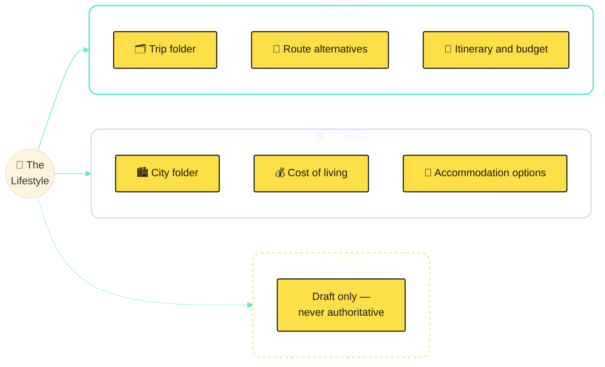
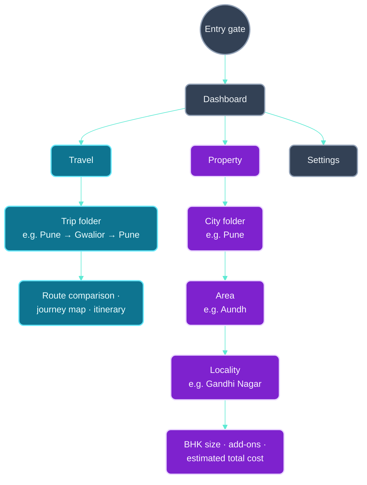
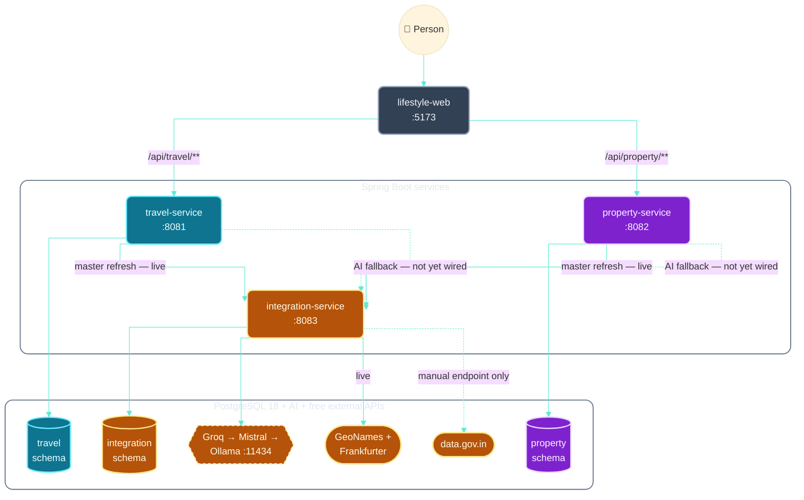
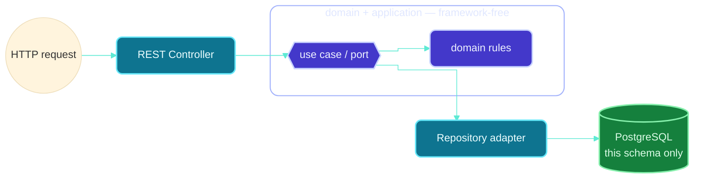
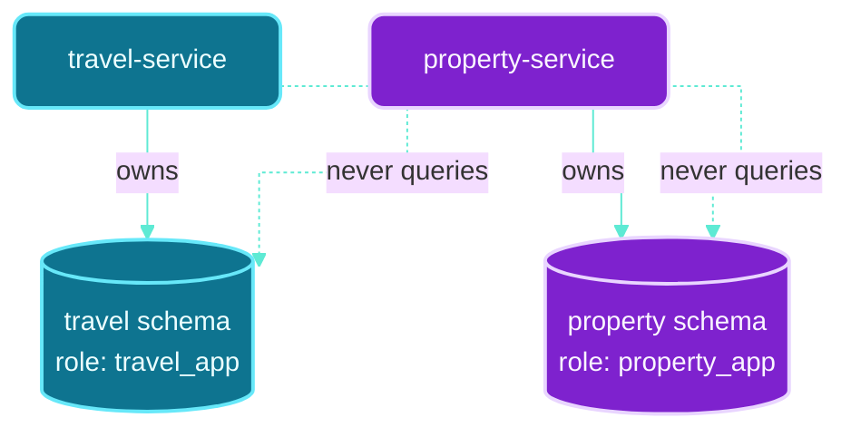
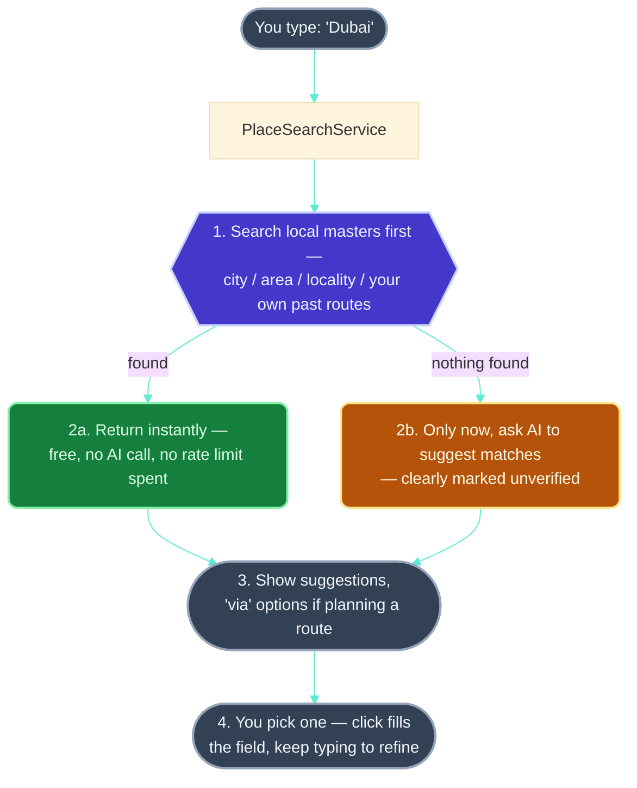
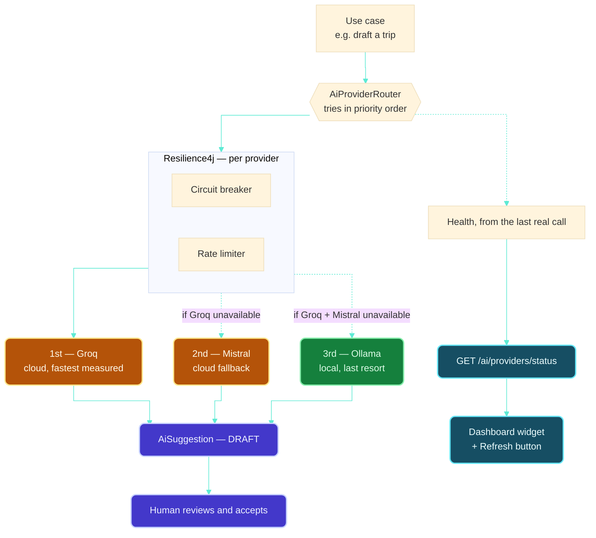
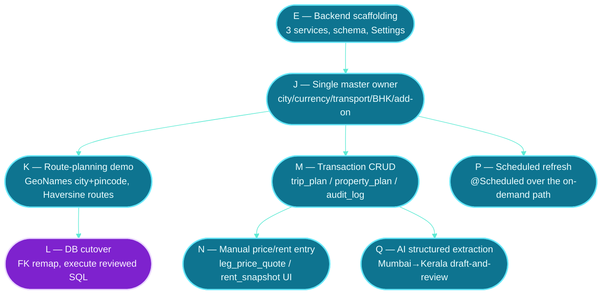

# Technical Architecture

> **Current implementation update, 2026-09-16:** The three services now target separate `travel`, `property`, and `integration` schemas in the existing local `postgres` database. Integration gained Flyway/JDBC storage for AI suggestion provenance and an Ollama-first provider using the optional Compose `ai` profile. Successful suggestions are stored as `UNVERIFIED`/`DRAFT` with provider, model, prompt version, generation time, and referenced data. The local 16 GB machine selected `qwen3:4b-instruct`; no model is pulled by Compose. Travel and Property still do not call Integration's AI endpoint. Older passages below describing Integration as database-free or this machine as lacking Java 25 are historical and superseded by this update. Backend tests/migrations remain unverified because the agent terminal's Gradle daemon failed before test execution with a Java loopback connection error; do not infer they pass.

How The Lifestyle is built, and why — written so anyone can follow it, no prior architecture background required. Terms are defined the first time they're used.

This is a personal, learning-driven project, not a client deliverable. It borrows patterns real teams use — bounded contexts, hexagonal architecture, ADRs, C4-style diagrams — to practice real engineering judgment at small scale, not to look impressive. Keep it developer-friendly and pragmatic over clever.

This is a living document, updated as things are built — not a log of every change. See [TECHNICAL_ARCHITECTURE_DECISION_LOG.md](TECHNICAL_ARCHITECTURE_DECISION_LOG.md) for what earns an entry there and the full history of why things were built the way they were.

Deeper references: [docs/architecture.md](docs/architecture.md), [docs/domain-model.md](docs/domain-model.md), [docs/technology-versions.md](docs/technology-versions.md), [docs/product-concept-ui.md](docs/product-concept-ui.md), [ADRs](docs/decisions/).

> All diagrams are [Mermaid](https://mermaid.js.org/), one consistent dark palette, each scoped to a single concern and kept small on purpose.

**Diagram style guide** — which convention applies to which kind of diagram, used consistently below and for anything added later:

| Diagram is showing... | Style |
|---|---|
| Full project architecture | Layered layout, rounded card nodes, nested containers, orthogonal connectors |
| A single feature's flow | Rounded nodes, top-to-bottom, curved connectors |
| Microservice internals | Layered component diagram, nested containers, orthogonal connectors |
| A user journey | Rounded cards, curved connectors (Miro/flowmapp style) |
| Database design | Flat entities, orthogonal relationship lines (true ER diagram once real tables exist) |
| Website structure / sitemap | Hierarchical, rounded nodes, top-to-bottom |
| Rough brainstorming | Free-form whiteboard, sticky notes |

Page-design mockups (Figma-style) and presentation/infographic polish are intentionally out of scope for this document — see [§2](#2-who-this-is-for) for why (no Artifact without explicit permission).

---

## 1. What this project is

A tool for planning two kinds of big life decisions: **travel trips** and **comparing cities to live in**. **Local-first** — runs entirely on your machine, no cloud account. **AI-optional** — AI can draft plans, but never invents facts like prices or visas; a human always approves before it becomes real data.

Currently **Phase 1**: the foundation (independent apps, isolated database schemas, a working web shell) is built. Trip and property planning themselves are Phase 2, not yet implemented. See [docs/roadmap.md](docs/roadmap.md).

---

## 2. Who this is for

**The problem:** trip and city-comparison planning today is scattered across tabs, notes, and screenshots that don't talk to each other. Nothing remembers a price change, nothing compares two routes side by side, nothing gives a plan one calm home.

**Persona — the Independent Planner:** one person (today, the project's own builder), planning their own trips and future moves. Comfortable with technology, wants one durable place to hold a plan, not a generic form-heavy dashboard. Desktop-first. Tone: calm and editorial — matching the app's own copy, *"Make room for what matters."*

**User stories**
- Hold an entire trip — route, stops, transport, budget — in one place.
- Compare two route alternatives (via Mumbai vs. via Delhi) side by side before committing.
- See where every price/estimate came from and when, to know whether to trust it.
- Let AI draft a plan from a description, but never let it become "the truth" without review.
- Compare cities to live in with the same rigor as trips.

**Site map** — drawn as a sticky-note board rather than Mermaid's native `mindmap` type (which failed to render for some viewers): each branch is one outlined, single-border group; the yellow tiles inside are the "ideas stuck to the board," not separate boxes with their own crossing lines.



**Primary flow** (full concept and worked examples: [docs/product-concept-ui.md](docs/product-concept-ui.md))


**Existing brand — reuse, don't redesign.** `lifestyle-web/src/styles.css` already has a real identity: the "L." logomark (deep teal-green, serif), Playfair Display + DM Sans. Palette:

| Swatch | Hex | Used for |
|---|---|---|
|  | `#143f40` | Logomark, primary tone |
|  | `#1c685c` | Links, interactive text |
|  | `#21745b` | Success/status-good |
|  | `#eaf0e8` | Section background |
|  | `#f8f6f1` | App background |

---

## 3. Information architecture

How the product's content and navigation are organized — separate from the visual polish in [§2](#2-who-this-is-for). Everything below is **built and real** in `lifestyle-web` (frontend only — see [§12](#12-where-the-project-is-today) for what's still missing on the backend side); nothing here is the proposed/dashed concept it used to be earlier in the project.

### 3.1 Sitemap / page hierarchy



Real routes in `App.tsx`: `/` (entry gate wraps everything), `/travel`, `/travel/trips/:tripId`, `/property`, `/property/cities/:cityId`, `/property/cities/:cityId/areas/:areaId`, `/property/cities/:cityId/areas/:areaId/localities/:localityId`, and `/settings` (§20). Travel/Property content is illustrative/static (see [§15](#15-functionality-chapters)) with no backend call behind it. `/settings` is the one exception — since 2026-09-16 it makes real HTTP calls to `travel-service`/`property-service` for currency options and master-refresh status/triggers (§20), even though that backend can't currently be exercised end-to-end from the machine this was built on (§12).

### 3.2 Navigation model

| Level | What | Example |
|---|---|---|
| **Primary** | Top navigation bar, always visible, with icons | Dashboard · Travel · Property |
| **Secondary** | Double-click a folder card to drill in (single click selects) | Travel folder → a trip folder → its detail page |
| **Contextual** | Tabs/pickers within a detail page | Route-comparison tabs, BHK-size picker, sort-by-rent toggle |

The folder metaphor from [docs/product-concept-ui.md](docs/product-concept-ui.md) was resolved as **stylized, not literal** (double-click semantics and folder visuals, plain CSS/React — not a simulated desktop window system).

### 3.3 Content taxonomy

The vocabulary each context uses to classify its own content — already defined in [docs/domain-model.md](docs/domain-model.md); listed here as the taxonomy, not redefined:

| Context | Content types |
|---|---|
| **Travel** | `TripPlan` (root) · `Destination` · `ItineraryDay` · `TravelLeg` (+ `TransportMode`) · `BorderCrossing` · `Accommodation` · `Budget` / `ExpenseItem` · `DocumentRequirement` · `PriceQuote` / `PriceSnapshot` · `AiSuggestion` |
| **Property** | `PropertyPlan` (root) · `CityProfile` · `AccommodationOption` · `MonthlyLivingCost` · `CommuteOption` · `CityScore` · `RentSnapshot` / `PropertyPriceSnapshot` · `AiRecommendation` |

Cross-cutting tags that apply across both: verification status (verified/unverified), AI status (`DRAFT`/`ACCEPTED`/`REJECTED`), and transport mode (air/train/road/waterway) for Travel legs specifically.

The frontend currently has its own smaller, illustrative version of this vocabulary, static in `tripData.ts`/`cityData.ts`/`areaData.ts` — `Trip`/`RouteOption`/`RouteLeg`/`LegOption` for Travel, `City`/`Area`/`Locality`/`BhkRent` for Property. These aren't the backend's domain types (no persistence, no API yet) but the shape is deliberately close, so wiring them to real endpoints later is a data-source swap, not a redesign.

### 3.4 Content hierarchy

What's prioritized on a page, top to bottom, as actually built:

- **Dashboard:** hero statement → "Last checked" recap (last-opened trip/city, if any). Deliberately just this — see [§14](#14-looking-ahead) and the decision log for why it's pinned to one viewport height with nothing else.
- **Trip detail:** cover image + title → route comparison (sort by cheapest/fastest, per-leg mode picker, running total) → journey map (illustrated waypoint trail) → itinerary (optional, hidden by default).
- **City detail:** cover image + title → areas list (sortable by rent) → "Did you know" facts specific to that city.
- **Locality detail:** name/area/pincode → BHK-size picker → add-on services (toggleable) → estimated total monthly cost.

---

## 4. Key terms

| Term | Plain-English definition | Why it matters here |
|---|---|---|
| **Monorepo** | One Git repository holding several apps instead of one repo each. | Review related changes together. [ADR-001](docs/decisions/ADR-001-monorepo.md). |
| **Bounded context** | A self-contained business area with its own rules — Travel and Property each define "plan" differently. From **Domain-Driven Design**. | Keeps Travel and Property from tangling as the project grows. |
| **Microservice** | A small, independently deployable app owning one bounded context. | `travel-service` and `property-service` own Travel's and Property's data; `integration-service` is the third, a bounded context of its own kind — not a business domain, but "talking to the outside world," owning zero data. [ADR-002](docs/decisions/ADR-002-microservices.md). |
| **SPA** | A web app that loads once, then updates itself without full page reloads. | `lifestyle-web` is a React SPA. |
| **Hexagonal architecture** (Ports & Adapters) | Core business logic (**domain**) knows nothing about frameworks or databases. "Ports" are interfaces it needs; "adapters" plug in the real tech (REST, database, AI). | Why `domain` packages have zero Spring/database imports — keeps rules testable and swappable. |
| **DTO** | A plain object that moves data across a boundary (API ↔ browser), kept separate from the domain model. | Internal changes don't silently break the public API shape. |
| **Schema (PostgreSQL)** | An isolated group of tables inside one database. | Travel and Property each own a schema; neither can touch the other's data. [ADR-003](docs/decisions/ADR-003-single-postgres-separate-schemas.md). |
| **Flyway migration** | A version-controlled SQL script, applied in order, tracked automatically. | Every environment's schema ends up identical. |
| **ADR** | A short, permanent record of one significant decision and its reasoning. | [docs/decisions/](docs/decisions/). |
| **JSONB** | A PostgreSQL column type for flexible, semi-structured data. | Only for variable provider metadata — never a substitute for typed columns. [docs/data-strategy.md](docs/data-strategy.md). |
| **Append-only snapshot** | A record that's never edited, only added to. | Price history stays comparable over time. [ADR-005](docs/decisions/ADR-005-price-snapshot-strategy.md). |
| **Provenance** | Metadata on where data came from — source, timestamp, confidence, verification. | Lets the system and user judge trustworthiness. |
| **LLM** | An AI model that reads/generates natural language (Llama, Gemma, Qwen). | Drafts suggestions only — never calculates facts. |
| **Ollama** | Free software that runs open-weight LLMs locally, no cloud account. | The project's default, fully optional AI provider. |
| **RAG** | Giving an AI model real retrieved data to reference before answering, reducing invented answers. | Planned later, backed by PostgreSQL full-text search first. |
| **Deterministic** | Same input always produces the same output, no randomness. | Money math, totals, sorting — always plain Java, never AI. |
| **C4 model** | Draws architecture at four zoom levels — Context, Container, Component, Code — one diagram per level. | [§5](#5-system-overview) is Context-level; [§6](#6-inside-one-backend-service) is Component-level. |

---

## 5. System overview

**Updated 2026-09-16 — now four apps, not three, and AI/external calls route through the fourth one, not straight from Travel/Property.** No cloud account, no paid API required — Groq/Mistral are free-tier cloud calls, everything else runs locally. (C4 Context level.)



Solid arrows: real, live, actually called today. Dashed: designed but not yet wired, or manual-trigger only. Colors: slate = shell/frontend, blue = Travel, purple = Property, amber = the integration layer (both `integration-service` itself and everything past it — AI providers and external APIs).

The web app never touches the database directly — only through a service's REST API. Travel never reads Property's schema, and neither ever calls Groq/Mistral/GeoNames/Frankfurter/data.gov.in directly — only `integration-service` does. [§7](#7-data-architecture), [§18](#18-ais-role-in-this-application).

---

## 6. Inside one backend service

All three services are structured identically, using hexagonal architecture ([§4](#4-key-terms)) — including `integration-service`, even though its "domain" is external calls rather than business rules. This is the most important structural rule in the codebase. (C4 Component level, one zoom step in from [§5](#5-system-overview).)



`domain`/`application` (center) hold the business rules in plain Java — no Spring, no JPA, no HTTP. The adapters either side are replaceable plugs: swap the REST controller for a CLI, or PostgreSQL for something else, and the business rules never change. `config` (not pictured — pure Spring wiring) connects adapters to ports.

This also makes AI safe by design ([§8](#8-ai-strategy)): it's just another outbound adapter. If it's off or fails, the use case still runs — it simply has no AI suggestion available.

---

## 7. Data architecture

One PostgreSQL 18 server for local development; three contexts (`travel`, `property`, `integration`) now share it as of 2026-09-16, but never share data — no cross-schema queries, each with its own role and Flyway history.



One PostgreSQL 18 instance, three schemas (`travel`/`property` above, plus `integration` — narrower, holding only `ai_suggestion` for AI-draft provenance, not business data), each its own login role and Flyway history — a setup convenience, not shared ownership. No cross-schema foreign keys, no shared queries; cross-context needs go through APIs. (This is an ownership diagram, not a true ER diagram — for that, see [§16](#16-planned-backend-data-model--masters-transactions-audit)'s real, flat-entity ER diagrams, which describe tables that now genuinely exist via Flyway, not a future-tense plan.)

- **Typed columns for facts, JSONB only for variable extras** — amount, currency, source, timestamp are always typed and queryable.
- **Price history is append-only** — corrections add a new observation, never overwrite the old one.

---

## 8. AI strategy

**Update 2026-09-16: this shape is no longer just planned — it's built, in `integration-service`.** The diagram below was written before any of it existed; it's kept because the shape it describes turned out to match what actually got built almost exactly (three interchangeable providers behind one fallback chain, DRAFT→ACCEPTED lifecycle) — the specific priority order changed later (§18, 2026-09-19: Groq → Mistral → Ollama, reordered after live latency testing), but the pluggable-provider shape itself held. See [§18](#18-ais-role-in-this-application) for the real, working detail: `AiProviderRouter`, real persistence of every draft into `integration.ai_suggestion`, and exactly what's still not wired up (the AI fallback isn't yet called by `travel-service`/`property-service`'s search). [ADR-004](docs/decisions/ADR-004-ai-provider-abstraction.md) has the original reasoning.


1. **AI never calculates money.** Totals, scores, sorting: deterministic Java only. AI explains or drafts, never computes.
2. **Every suggestion starts as a draft**, with model/prompt/timestamp/source recorded, until a human accepts it.
3. **The app works with AI off.** Non-AI workflows never depend on Ollama running.

Rollout order: structured extraction → missing-field detection → tool calling → explanations → RAG. [docs/ai-capability-roadmap.md](docs/ai-capability-roadmap.md).

---

## 9. Technology stack

Every entry is stable, free, and runs locally — no paid service required. Exact pinned versions: [docs/technology-versions.md](docs/technology-versions.md).

**Frontend**

| Technology | What it is | Why |
|---|---|---|
| React | UI library, reusable components | Dominant, well-documented SPA choice |
| TypeScript | JavaScript with static types | Catches mistakes before runtime |
| Vite | Build tool + dev server | Fast reload; provides the `/api/**` dev proxy |
| React Router | Client-side page routing | Already used in the app shell and the Travel folder/trip routes |
| TanStack Query | Server-state fetching/caching | Installed and the provider is wired at the app root (`main.tsx`), but not yet actually used anywhere — no `useQuery` call exists in the codebase yet. The Settings page's real backend calls (§20) use a plain `fetch` wrapper (`lib/apiClient.ts`) instead, for now |
| Vitest | Test runner | Fast feedback, native Vite/TS support |
| Tailwind CSS | Utility-class CSS framework (classes composed directly in JSX instead of hand-written stylesheet rules) | Enterprise-standard way to style a React app without a growing hand-rolled CSS file; `styles.css` is now just Tailwind's import plus the brand's design tokens (colors, fonts) as `@theme` variables — custom CSS only for the brand identity, nothing else |
| Heroicons | Icon set from the Tailwind team (outline/solid SVG components) | One consistent, minimal icon language across nav/folder cards, instead of mixed emoji |
| canvas-confetti | Small, dependency-free confetti-burst animation | The entry gate's celebratory moment on "Enter" — tiny (a few kB), no other library pulled in for it |

**Backend** (`travel-service`, `property-service`, `integration-service` — see [§18](#18-ais-role-in-this-application) for why there are three, not two)

| Technology | What it is | Why |
|---|---|---|
| Java (LTS) | Statically typed, long-term-supported language | Fewer forced upgrades; suits hexagonal domain modeling |
| Spring Boot | Web/DI framework | Industry standard for Java REST services |
| Gradle (wrapper checked in) | Build tool | Every clone gets the identical Gradle version |
| Flyway | DB migrations ([§4](#4-key-terms)) | Every environment's schema stays identical — real migrations now exist and have created the full §16 schema for travel/property, plus `integration.ai_suggestion` |
| Plain `JdbcTemplate`, not JPA | Direct SQL, no ORM | Deliberate for now — the only persistence code that exists (§12, §18, §20) is a handful of upsert/insert statements; no entity-mapping layer has been introduced yet |
| Resilience4j (core modules only) | Rate limiting + circuit breaking | Protects free-tier AI/API quotas (§17.3, §18) — the core library, constructed by hand, not the Spring Boot starter/autoconfig module, since that module's Boot-4.1 compatibility couldn't be verified on the machine that added it |
| springdoc-openapi (Swagger UI) | Generates a live API reference (`/swagger-ui.html`) + machine-readable contract (`/v3/api-docs`) from the controllers | Self-documenting API — can't silently go stale like hand-written docs |

**Data & infrastructure**

| Technology | What it is | Why |
|---|---|---|
| PostgreSQL | Free, ACID-compliant relational database | Typed columns + JSONB covers everything Phase 1–2 need; a real instance now exists with `travel`/`property`/`integration` schemas (§12) |
| Docker Compose | Multi-container local orchestration | **Reconciled 2026-09-17** — `compose.yaml` now containerizes all four apps (`lifestyle-web`, `travel-service`, `property-service`, `integration-service`, each with its own `Dockerfile`), plus `postgres`/`ollama`, with Compose Watch (`develop.watch`) rebuilding a service on source changes. The earlier native-Postgres note is resolved — this Compose file is the real setup now, run and verified working on the machine that has a real JDK 25 |
| Ollama | Local LLM runner, no cloud account | `integration-service`'s **last-resort** AI provider (§18, reordered 2026-09-19 after live latency testing put it behind both cloud options on this hardware) — still free/private/no-quota, confirmed working with `qwen3:4b-instruct` on the machine that has it running |

**Explicitly deferred** (not installed): Spring AI (no call site yet), pgvector, PostGIS, Redis, Kafka, Elasticsearch, MinIO, any second database. Each has a documented trigger condition in [docs/data-strategy.md](docs/data-strategy.md) — none added speculatively.

---

## 10. Non-negotiable engineering rules

- **Bounded contexts stay separate** — no shared tables, cross-schema FKs, or shared domain types. APIs only.
- **Domain code stays framework-free** — no Spring/JPA imports in `domain`. [§6](#6-inside-one-backend-service).
- **No paid services, auth, or new infra without explicit approval.**
- **AI output is never authoritative** — prices, visas, totals come from a verified source or deterministic code.
- **Money math is deterministic** — plain Java, reproducible.
- **Services are stateless** — no server-side session state; every request self-contained. Lets a service scale to N instances with zero rework; the only state that matters lives in PostgreSQL.
- **Generic over bespoke, but only while it stays simple** — reuse an existing component's shape by changing data/config before writing a new one; go bespoke only when genericizing would make the shared version *more* complex than two simple, separate things.

Full context: [AGENTS.md](AGENTS.md).

---

## 11. Architecture Decision Records

| ADR | Decision |
|---|---|
| [ADR-001](docs/decisions/ADR-001-monorepo.md) | One monorepo; apps still build/run independently |
| [ADR-002](docs/decisions/ADR-002-microservices.md) | Two independent services, not one combined app |
| [ADR-003](docs/decisions/ADR-003-single-postgres-separate-schemas.md) | One PostgreSQL instance, isolated schemas per service |
| [ADR-004](docs/decisions/ADR-004-ai-provider-abstraction.md) | AI behind a replaceable port; must run without it |
| [ADR-005](docs/decisions/ADR-005-price-snapshot-strategy.md) | Prices stored as immutable, append-only snapshots |

---

## 12. Where the project is today

Two different things are true at once here, and it's worth being precise about which is which:

- **Backend (`travel-service`, `property-service`, `integration-service`):** more built than "Phase 1 scaffolding" implies, but with real gaps that matter. A real Postgres instance now exists (on the Java-25-capable machine, not this one) with `travel`/`property`/`integration` schemas and restricted per-service roles. Flyway has created the **entire planned schema** from §16 for Travel and Property — masters, transaction tables, and audit log, not just a marker table — plus `integration.ai_suggestion` for AI-draft provenance. No JPA entity layer exists anywhere (a deliberate choice, not an oversight — see the decision log): the only code actually touching these tables is plain `JdbcTemplate`, and it only touches a few of them: `city`/`currency` masters (via `MasterRefreshUseCase`, §20) and `ai_suggestion` (via `PlaceSuggestionUseCase`, §18). Everything else in the schema — `trip_plan`, `route_option`, `rent_snapshot`, `cost_estimate`, and the rest — is real, created DDL with **zero application code reading or writing it yet**. Place *search* (`PlaceSearchController`) still reads from `InMemoryPlaceRepository`, a fixture list, **not** the now-real `city` table `MasterRefreshUseCase` populates — an inconsistency worth closing next, not a hidden secret. Cross-service HTTP calls exist for master refresh (`travel`/`property` → `integration-service` → GeoNames/Frankfurter) but not yet for the AI search fallback. Everything built on the Java-8 office-laptop machine this session (the master-refresh feature, the third microservice) is **written but not compiled** there — see §18/§20 for exactly which files and why that gap exists.
- **Frontend (`lifestyle-web`):** has grown well past a "shell" — a real entry experience, a working Travel flow (trip folders → route comparison with sortable multi-mode legs → an illustrated journey map → optional itinerary), a working Property flow (city folders → area/locality drill-down → BHK-size + add-on cost estimator), a working Settings page (§20), and a Dashboard AI-status widget (§15.4) all exist and run. Travel/Property content is still backed by static illustrative data (see [§3.3](#33-content-taxonomy)), not a live API — Settings and the Dashboard widget are the **two exceptions**: the only parts of this app that make a real HTTP call to a backend, though that backend can't currently be exercised end-to-end from this same machine (see above).

So: don't read "Phase 1" as "not much is built" anymore — real schema, real (if narrow) persistence, and a real cross-service call all exist now. Still genuinely not built anywhere: live price providers, a scheduler, most of the planned schema actually being read/written by application code, PDF export, auth, hosted deployment. [docs/roadmap.md](docs/roadmap.md) · [README.md](README.md).

### Responsibility map — what's responsible for what

One line per component, answering exactly one question each — useful when you're trying to find *which file* owns a piece of behavior.

| Component | Responsible for | Not responsible for |
|---|---|---|
| `lifestyle-web` | Everything you see and click; two real backend calls exist (Settings, Dashboard AI status) | Never talks to Postgres directly; never calls Groq/Mistral/GeoNames itself |
| `travel-service` | Travel's own data (schema `travel`), its `PlaceSearchUseCase` (search fixture, not the real `city` table yet), its `MasterRefreshUseCase` (city+currency, real) | Property's data; talking to Groq/Mistral/GeoNames/Frankfurter directly — always via `integration-service` |
| `property-service` | Property's own data (schema `property`), the same search/refresh pair as Travel, scoped to Property's masters | Travel's data; same external-call restriction as above |
| `integration-service` | Every external call, from any service — AI providers (`AiProviderRouter`), GeoNames, Frankfurter, data.gov.in; rate limiting, circuit breaking, and health tracking for all of them (`ResilienceGuard`); the one small `ai_suggestion` table for AI-draft provenance | Any Travel/Property business data; it owns no `trip_plan`, no `property_plan` |
| `ResilienceGuard` (inside integration-service) | Rate limiting + circuit breaking + health recording, for every outbound call, uniformly | Deciding *whether* to call — that's each `AiProvider`/client's `isConfigured()` check, done before `ResilienceGuard` is ever reached |
| `HealthStatusRegistry` (inside integration-service) | Remembering the outcome of the last real call per provider/client | Making any call itself — it's a passive record, written to only by `ResilienceGuard` |
| PostgreSQL | Storing whatever a use case actually chooses to persist — masters, AI drafts | Deciding what gets stored — that's each service's own use-case layer, in Java, never inferred from the schema |

### Data flow — what actually happens when you use the UI, and what (if anything) gets stored

This is worth being blunt about, since it's easy to assume more is wired up than actually is. Table below: an action you can take in the UI today, what happens when you do it, and whether anything reaches a database.

| You do this in the UI | What actually happens | Does it write to a database? |
|---|---|---|
| Browse Travel (trip folders, route comparison, journey map) | Reads `tripData.ts` — a static TypeScript array bundled into the app | **No.** Nothing is read from or written to Postgres. This is illustrative data, not your data. |
| Browse Property (city → area → locality, cost estimator) | Reads `cityData.ts`/`areaData.ts` — same static-array pattern | **No.** Same as above. |
| Type into a Travel/Property search box | `PlaceAutocomplete` calls `placeSearch.ts`, which searches the *same* static arrays client-side — no network call at all | **No.** This doesn't even reach a backend; it's pure frontend logic. |
| Open Settings, view currency options / master status | Real `fetch` calls to `travel-service`/`property-service`'s `/masters/currencies` and `/masters/refresh-status` | **Read-only** — reports what's already in `travel.currency`/`property.currency` and `*.master_refresh_log`. Nothing is written by viewing. |
| Click "Refresh master data" in Settings | `POST /api/{travel|property}/v1/masters/refresh` → `MasterRefreshUseCase` → `integration-service` (GeoNames + Frankfurter) → upserts into `travel.city`/`travel.currency` (or `property.*`) | **Yes — the only UI action in this app that writes real data today.** Upsert-only (§17.1), plus one row appended to `master_refresh_log` per master, every attempt, even on failure. |
| View the Dashboard's AI-status dots | Real `fetch` to `integration-service`'s `/ai/providers/status`, reading `HealthStatusRegistry` | **No write** — this is a read of in-memory state, not the database, and it doesn't call Ollama/Groq/Mistral either. |
| (Not yet exposed in any UI) An AI place-suggestion request | `PlaceSuggestionUseCase` calls a real AI provider, then writes the draft | **Yes**, into `integration.ai_suggestion` — but nothing in the UI can trigger this yet; it's only reachable by calling `integration-service`'s endpoint directly. |

The short version: **almost everything you can click today is a read of static frontend data, not a database.** The one exception that both writes to a real table *and* is reachable from the UI is the Settings page's "Refresh master data" button. Everything else described in §16 (trips, property plans, rent history, cost estimates) has real Postgres tables sitting empty, waiting for the CRUD backend that hasn't been built yet (phased plan, item 2).

---

## 13. Decision log

Moved to [`TECHNICAL_ARCHITECTURE_DECISION_LOG.md`](TECHNICAL_ARCHITECTURE_DECISION_LOG.md) — the full narrative history (2026-09-19), since it had grown to roughly 42% of this document's size and wasn't being reread as architecture reference material. This document stays focused on the system as it stands today; the decision log stays the place for *why* a specific past change was made. Not part of the default reading set for a new task — open it only when a specific decision's reasoning is actually needed.

---

## 14. Looking ahead

Not commitments — the honest answer to "how would this grow." Nothing here is scheduled; see [docs/roadmap.md](docs/roadmap.md) for what's actually planned.

- **Multiple users:** add an owner/tenant id to `TripPlan`/`PropertyPlan` and an auth adapter behind a port — domain logic untouched.
- **More bounded contexts:** a third *business* domain follows the same recipe — its own service, schema, ADR, never a shared table. (`integration-service`, added 2026-09-16, isn't an instance of this — it's an integration layer with no business domain of its own, not a fourth bounded context; see [§18](#18-ais-role-in-this-application).)
- **Real deployment:** swap the dev proxy for a reverse proxy, point at managed PostgreSQL — a config/adapter change, not a redesign.
- **Heavier AI:** ~~the `AiProvider` port has room for a second, paid adapter, opt-in, same draft-and-approve rules~~ — **built**, 2026-09-16: `integration-service` already has three (Ollama, Groq, Mistral) behind exactly this port, with the draft-and-approve `ai_suggestion` table live. What's still ahead: LLM ensembling for higher-stakes drafts (§18's "does more AI mean more accuracy" section) and wiring the fallback into `travel-service`/`property-service`'s own search.
- **Search:** `pgvector` is the documented next step if PostgreSQL full-text search isn't enough — not installed until measured need exists.
- **Data volume:** append-only snapshots grow over time; retention policy is a known future task, not an emergency.

Every item above already has a seam to grow into, because the boundaries were chosen up front — that's the payoff of these patterns: cheap change later, not looking impressive now.

---

## 15. Functionality chapters

What's actually been built, one chapter per capability, in build order. Unlike the decision log (records *choices*), a chapter records a *capability that exists now*.

**Template:** `<name>` — **What (functional):** what a person can now do. **Why:** the problem it solves. **How (technical):** layers touched, pattern reused. **Reusable as a template for:** what future work can copy by only changing data.

**15.1 — Service info endpoint.** *What:* `GET /api/travel/v1/info` (and property's equivalent) returns name, version, status — proof of life for a health check or the dashboard. *How:* `domain/ServiceStatus` (plain record) → `application/ServiceInfoUseCase` (`@Service`) → `adapter/in/web/ServiceInfoController` + DTO (`@RestController`, never returns the domain object directly). *Template for:* every future read endpoint follows this same four-file chain.

**15.2 — API documentation (Swagger UI).** *What:* both services serve a live API reference at `/swagger-ui.html` and a machine-readable contract at `/v3/api-docs`, generated from the controllers. *How:* `springdoc-openapi-starter-webmvc-ui` ([§9](#9-technology-stack)) inspects registered controllers automatically; a `config/OpenApiConfig` supplies only title/description/version. Lives in `config`, not `domain`/`application` — pure framework wiring. *Template for:* nothing to maintain as endpoints are added — that's the point.

**15.3 — Entry gate.** *What:* a full-screen "enter the app" moment on every fresh load (age-gate framing, not real verification) — a soft ambient light effect, a confetti burst on "Enter," then the Dashboard. *How:* `components/EntryGate.tsx` always renders `children` underneath and overlays itself with `fixed inset-0 z-50`, fading out rather than unmount/remount-swapping (that sequencing was the fix for an earlier white-flash bug). No `localStorage` — a fresh page load always shows it, since it wraps the router and in-app navigation never remounts it. *Template for:* any future full-screen overlay that needs to sit above the whole app without disturbing what's underneath.

**15.4 — Dashboard.** *What:* the hero statement, a "Last checked" recap linking back to the last-opened trip/city, and (since 2026-09-16) a compact **AI-model status row** below both — one dot per provider (Ollama/Groq/Mistral), green/red/orange. *How:* `pages/dashboard/DashboardHero.tsx` + `RecentlyChecked.tsx`, reading from `lib/lastAccessed.ts` (a small generic localStorage helper, `section: 'travel' | 'property'`); `features/dashboard/AiStatusWidget.tsx` calls `integration-service`'s `GET /api/integration/v1/ai/providers/status` directly (the first place `lifestyle-web` calls `integration-service`, not just `travel`/`property`) and renders nothing at all — not an error, just nothing — if that service isn't reachable, so a missing backend never breaks the Dashboard. `layout/AppShell.tsx` is route-aware — the Dashboard (`/`) alone is pinned to one viewport height with no scroll, everything else scrolls normally; the status row is deliberately one compact line to respect that. *Template for:* `lastAccessed` is reused as-is by Property; any future "recently viewed X" feature follows the same read/record pair. Verified: `npm run lint`/`test`/`build` all pass; not verified against a running `integration-service` (§12).

**15.5 — Travel: trip folders, route comparison, journey map.** *What:* `/travel` lists trip folders (double-click to open) plus a "Did you know" facts pod; a trip's detail page shows route alternatives (e.g. via Mumbai vs. via Delhi) with a per-leg mode picker (flight/train/road, each with fare + duration), a sort-by-cheapest/fastest control that auto-picks the best option per leg, a running total, an illustrated journey-map trail, and an optional (hidden by default) itinerary. *How:* static data in `features/travel/tripData.ts`; `components/RouteComparison.tsx` + `LegPicker.tsx` + `RouteCompareStrip.tsx` + `JourneyMap.tsx` + `ItinerarySection.tsx`, all under `features/travel/components/`, each single-purpose per [§10](#10-non-negotiable-engineering-rules)'s file-organization ask. *Template for:* §15.6 below reuses this same folder → detail → drill-down shape for Property; a future "AI Planner" surfacing a draft itinerary would plug into the same `ItinerarySection`-style optional-reveal pattern.

**15.6 — Property: city → area → locality drill-down.** *What:* `/property` lists city folders; a city's page shows its areas directly (sortable by rent) plus a city-specific facts pod; an area shows its localities (with pin codes); a locality lets you pick a home size (1RK–Villa) and toggle add-on services (tiffin, gym), computing an estimated monthly total live. *How:* static data in `features/property/cityData.ts` and `areaData.ts`; generic `components/RentSortList.tsx` (shared by the area list and the locality list) + `FolderCard`/`Cover`/`DataRow` reused from Travel. Only Pune has area-level data — `CityDetailPage` checks for it and quietly omits the section for cities that don't (Bengaluru), rather than showing an empty state. *Template for:* adding area data for another city is purely a `areaData.ts` edit — no component changes needed.

**15.7 — "Did you know" facts board.** *What:* a small pod of computed, honest facts (e.g. "via Mumbai beats via Delhi by ₹1,400," "Aundh has the lowest average rent in Pune") that auto-advances and can be paged with arrows, used on both the Travel and Property listing pages and on each city's page. *How:* generic `components/FactsBoard.tsx` (a real sliding conveyor, not a page-swap — see the decision log for why that distinction mattered) takes a plain `Fact[]`; each domain supplies its own generator (`factGenerators.ts`, `cityFactGenerators.ts`, `cityAreaFacts.ts`) that only computes from the app's own static data — nothing is invented, and a real-world claim (e.g. weather alerts) was deliberately left out for exactly that reason. *Template for:* any future "interesting facts about X" surface reuses `FactsBoard` unchanged, supplying only a new generator function.

---

## 16. Planned backend data model — masters, transactions, audit

**Update, 2026-09-16: the schema below is no longer just design — it's real DDL.** Every table described in this section exists in Postgres today, created by Flyway (`V1__phase1_marker.sql` + `V2__domain_tables.sql` in both `travel-service` and `property-service`). What's still true to the word "planned": almost none of it has application code reading or writing it yet. The two exceptions are `city`/`currency` (upserted by `MasterRefreshUseCase`, §20) and, in `integration-service`, an AI-draft-provenance table shaped like `ai_suggestion`/`ai_recommendation` below (§18). Everything else — `trip_plan`, `route_option`, `trip_leg`, `leg_price_quote`, `property_plan`, `rent_snapshot`, `cost_estimate`, and the rest — is real, migrated, and untouched by any use case. The frontend's static `tripData.ts`/`cityData.ts`/`areaData.ts` ([§3.3](#33-content-taxonomy)) already mirror this shape closely, so wiring them to this now-real backend is meant to be a data-source swap, not a redesign. Both services keep their own copy of every table — per [ADR-003](docs/decisions/ADR-003-single-postgres-separate-schemas.md) there is no cross-schema FK, so even a "shared" master like `city` or `currency` is duplicated per schema, each refreshed independently ([§17](#17-master-data-lifecycle)).

**The three kinds of table, defined once, reused for both contexts:**

| Kind | What it holds | Refreshed how | Deleted? |
|---|---|---|---|
| **Master** | Reference/lookup data that's true regardless of any one user's plan — cities, currencies, transport modes, BHK types, pincodes | Pulled/refreshed from an external source or curated list, on a schedule or on demand ([§17](#17-master-data-lifecycle)) | Rarely; superseded, not deleted |
| **Transaction** | A user's own data — a trip plan, a chosen route, a saved cost estimate | Created/edited/deleted by the user (full CRUD) | Yes — a trip or property plan is the user's to delete |
| **Audit** | A record of what changed, when, and by what | Written automatically alongside every transaction-table write | Never — append-only, same principle as [ADR-005](docs/decisions/ADR-005-price-snapshot-strategy.md)'s price snapshots |

One generic `audit_log` table per service (not one audit table per transaction table) — `(entity_type, entity_id, action, changed_at, changed_by, diff_json)` — per the [generic-over-bespoke rule](#10-non-negotiable-engineering-rules): every future transaction table gets audit coverage by writing to the same table, not by adding a new one.

### 16.1 Travel schema

Split into two smaller diagrams on purpose — one dense diagram trying to show every table *and* every column was part of why the last version was hard to read. Columns live in the table underneath instead.

**Master data, and the exact FK column each transaction table uses to reference it.** `||` = exactly one, `o{` = zero-or-many (standard crow's-foot notation); the label on each line is the real FK column name, never a vague verb. **Teal = master** (this diagram's subject, refreshed from an external source or CRUD-managed); **slate = transaction** (shown only as the FK target — full detail is in the next diagram):

```mermaid
%%{init: {'theme': 'base', 'themeVariables': {'background':'transparent','fontFamily':'Trebuchet MS, Verdana, sans-serif','fontSize':'16px','lineColor':'#5eead4'}}}%%
erDiagram
    CITY {
        uuid id PK
        string name
        string country_code
        numeric latitude
        numeric longitude
    }
    TRANSPORT_MODE {
        uuid id PK
        string code
        string label
    }
    CURRENCY {
        uuid id PK
        string iso_code
        numeric exchange_rate_to_base
    }
    VISA_REQUIREMENT {
        uuid id PK
        string origin_country
        string destination_country
        text requirement_text
    }
    TRIP_LEG {
        uuid id PK
        uuid route_option_id FK
        uuid from_city_id FK
        uuid to_city_id FK
        uuid transport_mode_id FK
        int leg_order
    }
    LEG_PRICE_QUOTE {
        uuid id PK
        uuid trip_leg_id FK
        uuid currency_id FK
        numeric amount
    }
    DOCUMENT_REQUIREMENT {
        uuid id PK
        uuid trip_plan_id FK
        uuid visa_requirement_id FK
        boolean verified
    }

    CITY ||--o{ TRIP_LEG : "from_city_id"
    CITY ||--o{ TRIP_LEG : "to_city_id"
    TRANSPORT_MODE ||--o{ TRIP_LEG : "transport_mode_id"
    CURRENCY ||--o{ LEG_PRICE_QUOTE : "currency_id"
    VISA_REQUIREMENT ||--o{ DOCUMENT_REQUIREMENT : "visa_requirement_id"

    classDef master fill:#0e7490,stroke:#67e8f9,color:#ecfeff,stroke-width:2px;
    classDef txn fill:#334155,stroke:#94a3b8,color:#f1f5f9,stroke-width:1.5px;
    class CITY,TRANSPORT_MODE,CURRENCY,VISA_REQUIREMENT master;
    class TRIP_LEG,LEG_PRICE_QUOTE,DOCUMENT_REQUIREMENT txn;
```

**A trip and everything it owns.** Same notation — the relationship label is always the real FK column, never "has"/"have". **Teal = a normal transaction row** (created/edited/deleted by the user); **slate dashed = append-only** (`leg_price_quote` — never updated in place, only ever a new row, §17.1); **amber dashed = AI-drafted, unverified until a human accepts it** (`ai_suggestion`, §18):

```mermaid
%%{init: {'theme': 'base', 'themeVariables': {'background':'transparent','fontFamily':'Trebuchet MS, Verdana, sans-serif','fontSize':'16px','lineColor':'#5eead4'}}}%%
erDiagram
    TRIP_PLAN {
        uuid id PK
        string title
        string status
    }
    ROUTE_OPTION {
        uuid id PK
        uuid trip_plan_id FK
        string label
    }
    TRIP_LEG {
        uuid id PK
        uuid route_option_id FK
        uuid from_city_id FK
        uuid to_city_id FK
        uuid transport_mode_id FK
        int leg_order
    }
    LEG_PRICE_QUOTE {
        uuid id PK
        uuid trip_leg_id FK
        uuid currency_id FK
        numeric amount
        timestamp captured_at
    }
    ITINERARY_DAY {
        uuid id PK
        uuid trip_plan_id FK
        int day_number
        string title
    }
    DOCUMENT_REQUIREMENT {
        uuid id PK
        uuid trip_plan_id FK
        uuid visa_requirement_id FK
        boolean verified
    }
    AI_SUGGESTION {
        uuid id PK
        uuid trip_plan_id FK
        string acceptance_status
    }

    TRIP_PLAN ||--o{ ROUTE_OPTION : "trip_plan_id"
    ROUTE_OPTION ||--o{ TRIP_LEG : "route_option_id"
    TRIP_LEG ||--o{ LEG_PRICE_QUOTE : "trip_leg_id"
    TRIP_PLAN ||--o{ ITINERARY_DAY : "trip_plan_id"
    TRIP_PLAN ||--o{ DOCUMENT_REQUIREMENT : "trip_plan_id"
    TRIP_PLAN ||--o{ AI_SUGGESTION : "trip_plan_id"

    classDef txn fill:#0e7490,stroke:#67e8f9,color:#ecfeff,stroke-width:2px;
    classDef append fill:#334155,stroke:#94a3b8,color:#f1f5f9,stroke-width:2px,stroke-dasharray:4 4;
    classDef draft fill:#b45309,stroke:#fde68a,color:#fffbeb,stroke-width:2px,stroke-dasharray:4 4;
    class TRIP_PLAN,ROUTE_OPTION,TRIP_LEG,ITINERARY_DAY,DOCUMENT_REQUIREMENT txn;
    class LEG_PRICE_QUOTE append;
    class AI_SUGGESTION draft;
```

| Table | Kind | Key columns (beyond id/timestamps) |
|---|---|---|
| `city` | Master | name, country_code, lat/long, timezone — refreshed from GeoNames |
| `currency` | Master | iso_code, symbol, exchange_rate_to_base, rate_captured_at — refreshed from Frankfurter |
| `transport_mode` | Master | code (flight/train/road/waterway), label |
| `visa_requirement` | Master | origin_country, destination_country, requirement_text, source_url, verified_at — **manually curated**, no reliable free live source exists ([§19](#19-data-validation--honest-limitations)) |
| `trip_plan` | Transaction | title, status, created_at |
| `route_option` | Transaction | trip_plan_id, label (e.g. "via Mumbai") |
| `trip_leg` | Transaction | route_option_id, from_city_id, to_city_id, transport_mode_id, order |
| `leg_price_quote` | Transaction (append-only, like a price snapshot) | trip_leg_id, currency_id, amount, duration_hours, source, captured_at, confidence |
| `itinerary_day` | Transaction | trip_plan_id, day_number, title, detail |
| `document_requirement` | Transaction | trip_plan_id, visa_requirement_id, verified (bool) |
| `ai_suggestion` | Transaction | trip_plan_id, model, prompt_version, payload_json, status (`DRAFT`/`ACCEPTED`/`REJECTED`) |
| `audit_log` | Audit | entity_type, entity_id, action, diff_json, changed_at |

### 16.2 Property schema

Same split as Travel — masters/geography in one diagram, a plan and what it owns in the other; full columns are in the table below.

**Geography masters** (a strict one-to-many chain: one city has many municipalities/areas, one area has many localities, one locality has many pincodes — every arrow labeled with the actual FK column, not "contains"/"governs"):

```mermaid
%%{init: {'theme': 'base', 'themeVariables': {'background':'transparent','fontFamily':'Trebuchet MS, Verdana, sans-serif','fontSize':'16px','lineColor':'#c084fc'}}}%%
erDiagram
    CITY {
        uuid id PK
        string name
        string country_code
    }
    MUNICIPALITY {
        uuid id PK
        uuid city_id FK
        string name
        string code
    }
    AREA {
        uuid id PK
        uuid city_id FK
        uuid municipality_id FK
        string name
    }
    LOCALITY {
        uuid id PK
        uuid area_id FK
        string name
    }
    PINCODE {
        uuid id PK
        uuid locality_id FK
        string code
    }

    CITY ||--o{ MUNICIPALITY : "city_id"
    CITY ||--o{ AREA : "city_id"
    MUNICIPALITY ||--o{ AREA : "municipality_id"
    AREA ||--o{ LOCALITY : "area_id"
    LOCALITY ||--o{ PINCODE : "locality_id"

    classDef master fill:#7e22ce,stroke:#e9d5ff,color:#faf5ff,stroke-width:2px;
    class CITY,MUNICIPALITY,AREA,LOCALITY,PINCODE master;
```

This is exactly the chain [§21 phase L](#21-phased-plan)'s pincode proposal has to respect: `pincode` needs a real `locality_id`, which needs a real `area_id`, which needs a real `city_id` — GeoNames' flat postal-code data can't supply that chain, which is why it's staged separately (`integration.city_pincode`) instead of written here.

**A property plan and its cost estimate.** This version also draws `cost_estimate_addon`, the join table the previous version of this diagram omitted: a `cost_estimate` can include **many** add-ons, and a `service_addon` can appear on **many** cost estimates — a genuine many-to-many, modeled the only correct way a relational schema can (a junction/associative table with two FKs and no independent identity of its own, hence no `id` column — its primary key is the pair `(cost_estimate_id, service_addon_id)`). **Purple = master, teal = transaction, slate dashed = append-only, amber dashed = the junction table and the AI draft** — same color language as the Travel diagrams above, so both schemas read the same way at a glance:

```mermaid
%%{init: {'theme': 'base', 'themeVariables': {'background':'transparent','fontFamily':'Trebuchet MS, Verdana, sans-serif','fontSize':'16px','lineColor':'#c084fc'}}}%%
erDiagram
    LOCALITY {
        uuid id PK
        string name
    }
    BHK_TYPE {
        uuid id PK
        string code
        string label
    }
    SERVICE_ADDON {
        uuid id PK
        string code
        string label
    }
    PROPERTY_PLAN {
        uuid id PK
        string title
        string status
    }
    RENT_SNAPSHOT {
        uuid id PK
        uuid locality_id FK
        uuid bhk_type_id FK
        uuid currency_id FK
        numeric amount
        timestamp captured_at
    }
    COST_ESTIMATE {
        uuid id PK
        uuid property_plan_id FK
        uuid locality_id FK
        uuid bhk_type_id FK
        uuid currency_id FK
        numeric total_amount
    }
    COST_ESTIMATE_ADDON {
        uuid cost_estimate_id FK
        uuid service_addon_id FK
        numeric amount
    }
    AI_RECOMMENDATION {
        uuid id PK
        uuid property_plan_id FK
        string acceptance_status
    }

    LOCALITY ||--o{ RENT_SNAPSHOT : "locality_id"
    BHK_TYPE ||--o{ RENT_SNAPSHOT : "bhk_type_id"
    PROPERTY_PLAN ||--o{ COST_ESTIMATE : "property_plan_id"
    LOCALITY ||--o{ COST_ESTIMATE : "locality_id"
    BHK_TYPE ||--o{ COST_ESTIMATE : "bhk_type_id"
    COST_ESTIMATE ||--o{ COST_ESTIMATE_ADDON : "cost_estimate_id"
    SERVICE_ADDON ||--o{ COST_ESTIMATE_ADDON : "service_addon_id"
    PROPERTY_PLAN ||--o{ AI_RECOMMENDATION : "property_plan_id"

    classDef master fill:#7e22ce,stroke:#e9d5ff,color:#faf5ff,stroke-width:2px;
    classDef txn fill:#0e7490,stroke:#67e8f9,color:#ecfeff,stroke-width:2px;
    classDef append fill:#334155,stroke:#94a3b8,color:#f1f5f9,stroke-width:2px,stroke-dasharray:4 4;
    classDef special fill:#b45309,stroke:#fde68a,color:#fffbeb,stroke-width:2px,stroke-dasharray:4 4;
    class LOCALITY,BHK_TYPE,SERVICE_ADDON master;
    class PROPERTY_PLAN,COST_ESTIMATE txn;
    class RENT_SNAPSHOT append;
    class COST_ESTIMATE_ADDON,AI_RECOMMENDATION special;
```

`currency_id` also appears on `rent_snapshot`/`cost_estimate` (dropped from this diagram's boxes only to keep it under the 8-entity limit this document's diagrams target — `currency`'s full shape is already drawn once in Travel's masters diagram above and noted in the column table below).

| Table | Kind | Key columns |
|---|---|---|
| `city` | Master | same shape as Travel's — its own copy, own refresh |
| `municipality` | Master | name, code (e.g. PMC/PCMC), city_id |
| `area` | Master | name, city_id, municipality_id |
| `locality` | Master | name, area_id |
| `pincode` | Master | code, locality_id — refreshed from a postal/pincode dataset |
| `bhk_type` | Master | code (1RK…Villa), label |
| `service_addon` | Master | code (tiffin/gym/…), label, is_active |
| `currency` | Master | shared shape/pattern with Travel, own copy |
| `property_plan` | Transaction | title, status |
| `rent_snapshot` | Transaction (append-only) | locality_id, bhk_type_id, currency_id, amount, source, captured_at, confidence |
| `cost_estimate` | Transaction | property_plan_id, locality_id, bhk_type_id, selected_addon_ids, total_amount, computed_at |
| `ai_recommendation` | Transaction | property_plan_id, model, prompt_version, payload_json, status |
| `audit_log` | Audit | same generic shape as Travel's — own instance |

A real, granular fact like "does Aundh actually have any 4BHK inventory" belongs in `rent_snapshot` presence/absence — if no snapshot exists for a `(locality, bhk_type)` pair, the honest answer is "unknown," not "no" and not a guessed number. [§19](#19-data-validation--honest-limitations) covers this in more depth.

---

## 17. Master data lifecycle

**The mechanism, two triggers, one shared shape:**

- **On-demand** — a person clicks "Refresh masters" in [Settings](#20-settings-frontend), which calls one endpoint per master type (e.g. `POST /api/travel/v1/masters/currency/refresh`). Useful right before planning something, per the "whenever I start working on something" case.
- **Scheduled** — later, Spring's built-in `@Scheduled` (free, no new infrastructure — no Kafka/cron service needed) runs the same refresh logic periodically. Cadence matches how often the real data actually changes: currencies daily, city/pincode masters monthly-ish, visa requirements on a much longer, manually-reviewed cycle since no reliable free live source exists for them.

Both triggers call the same `MasterRefreshJob` per master type — one small port/adapter per master (`CurrencyRefreshJob`, `CityMasterRefreshJob`, `PincodeMasterRefreshJob`, …), each knowing how to pull its one external source and upsert into its master table. A `master_refresh_log` row is written every run (`master_type, started_at, completed_at, records_upserted, status, error_message`) — this is what the Settings screen shows as "last refreshed."

**Built so far (§20) is a smaller, honest first slice of this design, not the whole thing:** one `MasterRefreshUseCase` per service refreshing `city` + `currency` together behind a single `POST /api/{travel|property}/v1/masters/refresh` (not yet split into one job/endpoint per master type), on-demand only (no `@Scheduled` yet), logging to a real `master_refresh_log` table (column named `master_name`, not `master_type`, but otherwise this exact shape). `pincode`/`transport_mode`/visa data are not refreshed at all yet — see the gap called out below and in §20.

**Free sources for the masters that actually have one:**

| Master | Free source | Notes |
|---|---|---|
| `city` (worldwide) | [GeoNames](https://www.geonames.org/) | Free bulk download + a rate-limited free API; the most complete free worldwide place-name dataset |
| `pincode` (India) | [data.gov.in](https://www.data.gov.in/) open postal datasets | Government open data, free, periodically updated |
| `currency` exchange rates | [Frankfurter](https://frankfurter.dev/) | Already the project's documented choice ([docs/free-data-sources.md](docs/free-data-sources.md)); free, no key |
| `country` | [REST Countries](https://restcountries.com/) | Already documented |
| Map tiles (display only) | [OpenStreetMap](https://www.openstreetmap.org/) + [Leaflet](https://leafletjs.com/) | For showing a map later, not for routing data |
| Geocoding | [Nominatim](https://operations.osmfoundation.org/policies/nominatim/) | Usage-policy limits apply — fine for occasional lookups, not bulk |
| Road routing | [OSRM](https://project-osrm.org/) / [GraphHopper](https://www.graphhopper.com/open-source/) | Road distance/time only |

**Masters with no free live source — the honest gap:** `transport_mode` schedules (does a train actually run Pune→Gwalior on a given date), flight fares, and real rent/listing data for `rent_snapshot` all lack a comprehensive free API. IRCTC and airline fare data are effectively paid/restricted; property-listing sites' terms generally prohibit scraping (a hard rule in this project already — [AGENTS.md](AGENTS.md)). These start as **manual entry**, exactly like the illustrative data already in the frontend, and stay that way until a specific free or user-approved-paid source is identified — see [§19](#19-data-validation--honest-limitations).

**A GeoNames-specific limitation, from its own docs:** postal-code coverage for Canada, Ireland and Malta is only the first few characters of the full code (copyright reasons on their end, not ours), Argentina's postal data predates that country's 1999 system change, and Brazil only has one major code per municipality, not full coverage. None of this affects Pune/India, where this project's actual focus is — but worth knowing before assuming GeoNames' pincode data is equally complete everywhere if this ever expands past India.

### 17.1 Refresh means upsert-and-append, never delete

This is worth stating as an explicit rule, not just an implied one: **a refresh never removes a row.**

- **Master tables are upserted, per record.** Refreshing `city` updates the matching row if GeoNames' data changed, inserts a new row if it's a place not seen before, and **touches nothing else**. If GeoNames drops a city from its dataset, this app doesn't delete it — a plan referencing it would break, which is worse than keeping a slightly stale master row.
- **Transaction/snapshot tables never update in place — they append.** A new `leg_price_quote` or `rent_snapshot` row is *inserted* with a fresh `captured_at`; the previous one stays exactly as it was, forever. This is [ADR-005](docs/decisions/ADR-005-price-snapshot-strategy.md)'s rule, generalized to every observed price in both schemas, not just Travel's.
- **Every write is scoped to one record, not a batch replace.** A `MasterRefreshJob` loops record-by-record (or in small transactional batches) — one bad record from the source fails and gets logged, the other 4,999 still update. There's no "truncate then reload" anywhere in this design, because a truncate-then-reload that fails halfway is exactly the kind of silent data loss this rule exists to prevent.

### 17.2 Price history — what changed, without losing what it was

The append-only rule above is what makes this possible: because `leg_price_quote` and `rent_snapshot` never overwrite, the *previous* value is always still there to compare against.

- A `price_history` read model (a query, not a new stored table) takes the two most recent snapshots for the same `(trip_leg, mode)` or `(locality, bhk_type)` and computes the difference — deterministic Java, the same "money math is never AI" rule as everywhere else in this project.
- The UI surface for this is exactly what you described: *"was ₹4,200 on 12 Sep, now ₹4,650 — up 10.7%."* It reads directly off two rows that both still exist; nothing was deleted to produce that sentence.
- This is also precisely the input to the AI price-change narration use case in [§18](#18-ais-role-in-this-application) below — Java computes the number, AI only turns it into a sentence.

### 17.3 What happens when a refresh call fails

Researched against current (2026) practice for calling external APIs from a Spring Boot service — the standard toolkit is [Resilience4j](https://www.baeldung.com/spring-boot-resilience4j) (the successor to Netflix Hystrix, which is in maintenance mode), not something bespoke:

| Failure pattern | What it does | Applied here to |
|---|---|---|
| **Retry** | Retries a failed call a bounded number of times, only for transient/network errors — never for a 4xx, since retrying an unrecoverable error just wastes time | A `MasterRefreshJob` hitting GeoNames/Frankfurter and getting a timeout |
| **Circuit breaker** | After enough consecutive failures, stops calling the failing source for a cooldown window instead of hammering it, then tries a limited number of test calls before fully reopening | Protects this app (and the free API's rate limit) if GeoNames is down or the free quota is exhausted |
| **Rate limiter** | Caps outgoing calls to stay under a source's published quota | GeoNames specifically — its free tier is capped (documented as roughly 20,000–30,000 credits/day, ~1,000–2,000/hour, varying by source) — worth respecting so the app never gets the key blocked |
| **Bulkhead** | Isolates one slow external dependency so it can't starve resources needed by the rest of the service | Keeps a slow visa-data lookup, for instance, from blocking Travel's other endpoints |

**Concretely, when a refresh fails partway:** the `master_refresh_log` row for that run is marked `FAILED` with the error message, the master table keeps whatever it successfully upserted before the failure (§17.1's per-record rule) plus everything from the last successful run, and the Settings screen shows the failure plainly rather than silently pretending the refresh succeeded. Nothing user-facing breaks — a stale-but-present master is always safer than a missing one.

### 17.4 Master → external dependency table (updated 2026-09-19, all four keys live-tested)

The direct answer to "which master needs which external system" — every `lifestyle_master` table plus the one masters-adjacent staging table, each with its real dependency and current live status. AI providers (Ollama/Groq/Mistral) are deliberately **not** in this table — no master is ever written by AI; that's covered separately in [§18's fallback-order section](#multiple-ai-providers--the-full-architecture).

| Master | External dependency | Live status | Who calls it |
|---|---|---|---|
| `lifestyle_master.city` | [GeoNames](https://www.geonames.org/) `searchJSON` (named seed cities) **+** `searchJSON?country=IN&featureClass=P&orderby=population` (bulk discovery) | ✅ **Live** — confirmed 2026-09-19; the bulk pass targets 100+ real, sourced Indian cities per refresh (paged, bounded — §17.5.1), not just the ~6 named seed cities | `MasterDataRefreshUseCase.refreshCities()` |
| `lifestyle_master.currency` | [Frankfurter](https://frankfurter.dev/) `/latest?base=` (no `symbols` filter) | ✅ **Live** — no key needed. Imports every currency Frankfurter returns for the base, not a pre-configured shortlist (changed 2026-09-19 — see §17.5.1) | `MasterDataRefreshUseCase.refreshCurrencies()` |
| `lifestyle_master.city_pincode` (same-shaped sibling table — **not** `lifestyle_master.pincode`, see §21 phase L) | [GeoNames](https://www.geonames.org/) `postalCodeSearchJSON` | ✅ **Live** — same account as city search. Switched 2026-09-19 from the earlier `integration.city_pincode` staging table now that this real-FK sibling exists — see §17.5 and the decision log | `MasterDataRefreshUseCase.refreshIndianPincodes()` |
| `lifestyle_master.transport_mode` | None — CRUD only, plus AI-drafted proposals (§17.5) | ✅ Mechanism live (`POST /transport-modes`, or `POST /transport-modes/acquire` for a reviewable AI draft); **table itself is empty** until someone posts/accepts real rows (§21 item U) | A human via Swagger, or a future admin UI |
| `lifestyle_master.bhk_type` | None — CRUD only, plus AI-drafted proposals (§17.5, fully wired end to end) | Same as above | Same as above |
| `lifestyle_master.service_addon` | None — CRUD only, plus AI-drafted proposals (§17.5) | Same as above | Same as above |
| `lifestyle_master.visa_requirement` | None — no free live source exists at all | ❌ **UNSUPPORTED** — `/refresh-status` now reports this explicitly (synthetic status, never a bare `null`, §17.5.1) rather than an automated pipeline. A visa rule is an asserted fact (§10 forbids inventing one). AI *may* draft a reviewable proposal (§17.5) with provenance, but it stays DRAFT forever unless a human accepts it, and acceptance never auto-writes the real row (real FK/hierarchy risk) | Manual entry, or an accepted `master_proposal` copied in by hand |
| `lifestyle_master.municipality` | [data.gov.in](https://www.data.gov.in/) All-India Pincode Directory | ❌ **UNSUPPORTED** (`/refresh-status`) — key confirmed live 2026-09-19 (165,627 real records, fields include `circlename`/`regionname`/`divisionname`) — but **no code reads this yet**; the field-to-column mapping is designed, not implemented | Not built yet |
| `lifestyle_master.area` | Same data.gov.in dataset | ❌ **UNSUPPORTED** (`/refresh-status`) — key works, no integration code yet | Not built yet |
| `lifestyle_master.locality` | Same data.gov.in dataset | ❌ **UNSUPPORTED** (`/refresh-status`) — key works, no integration code yet | Not built yet |
| `lifestyle_master.pincode` | Same data.gov.in dataset, **plus** requires `locality_id` — see §21 phase L's schema proposal before this can be honestly populated | ❌ **UNSUPPORTED** (`/refresh-status`) — key works, no integration code yet, and the schema question is still open | Not built yet |

**What changed today:** every external dependency above that *can* be live (GeoNames, Frankfurter, data.gov.in) now has a working, tested key. The remaining gap for `municipality`/`area`/`locality`/`pincode` is entirely application code (mapping data.gov.in's real field names onto this hierarchy) — not credentials, not network reachability, not a design question anymore now that the actual response shape is confirmed.

### 17.5.1 Refresh completeness pass (2026-09-19) — bulk city discovery, all-currency import, honest status for unsupported masters

Three changes closed the gap between "the refresh button exists" and "the refresh button actually gives single-owner-quality coverage":

1. **City refresh is no longer limited to ~6 named seed cities.** `GeoNamesClient.searchByCountry(countryCode, maxRows, startRow)` queries GeoNames by `country=IN&featureClass=P&orderby=population`, paged via `startRow`, bounded by `app.masters.india-city-target-count`/`-page-size`/`-max-pages` (default 100/100/5 — a worst case of 500 GeoNames credits per refresh, well under the account's 1,000/hour ceiling). Every named seed city (Pune, Mumbai, Gwalior, Delhi, Dubai, Bengaluru) is still looked up by exact name first, for backward compatibility with existing illustrative data and Dubai's non-Indian example.
2. **Currency refresh imports every currency Frankfurter returns**, not a 3-currency tracked shortlist — `FrankfurterClient.latest(base)` drops the `symbols` parameter entirely (Frankfurter's own documented way to return its full supported set). `app.masters.tracked-currencies` was removed as dead config.
3. **`/refresh-status` now distinguishes "never refreshed, no source exists" from "never refreshed yet, but could be.**" `visa_requirement`/`municipality`/`area`/`locality`/`pincode` synthesize an explicit `UNSUPPORTED` status (never written to `master_refresh_log` — there was no real attempt to log) instead of a bare `null`, and every master's status response now also carries `source` (a short, honest description of where its data comes from) and `failureReason` (the real error text from the last FAILED/PARTIAL attempt).

Indian pincode refresh, by necessity, stays bounded to `app.masters.india-pincode-city-limit` (default 20) cities per run even though city refresh can now produce 100+ Indian cities — one `searchPostalCodes` call per city would otherwise spend most of an hourly GeoNames quota on a single Settings-page click.

### 17.5 Master proposals — reviewable AI drafts, and prompt-driven acquisition (added 2026-09-19)

Two related pieces, both living in `integration.master_proposal` (one generic table, reused across master types, matching §10's generic-over-bespoke rule — never one table per master type):

**Reviewable drafts for masters with no verified provider at all** — `visa_requirement` and the `municipality`/`area`/`locality`/`pincode` hierarchy. `MasterProposalUseCase`/`MasterProposalController` (`POST /api/integration/v1/masters/lifestyle/proposals`, `GET .../proposals?status=`, `POST .../{id}/accept`, `POST .../{id}/reject`) let an AI-produced idea for one of these be recorded with its provenance and stay `DRAFT` until a human explicitly accepts or rejects it. Accepting one of these **only flips its own status** — it never automatically writes into `visa_requirement`/`municipality`/etc., because those tables carry real FK/hierarchy constraints (e.g. `locality` needs a real `area`→`municipality`→`city` chain) a generic accept step can't safely satisfy. Turning an accepted idea into a real row stays a deliberate, separate, manual step through the existing masters API.

**Prompt-driven acquisition for the three flat, FK-free coded masters** — `transport_mode`/`bhk_type`/`service_addon` (all three share the exact `code`/`label` shape via `CodedMasterRepository`). `MasterAcquisitionUseCase` (`POST .../bhk-types/acquire`, `.../transport-modes/acquire`, `.../service-addons/acquire`) sends a versioned, file-backed prompt (`PromptRegistry`, loading `integration-service/src/main/resources/prompts/{masterType}.v{n}.json` at startup) to whichever AI provider `AiProviderRouter` reaches first, parses the reply as **untrusted JSON**, and for each candidate:
1. Rejects it if required fields are missing, or its `code` doesn't match the prompt definition's fixed `allowedValues` list or `codeFormatRegex` — this fixed, human-authored rule check, done in Java, is what "verified" means here. A model asserting something, or two providers agreeing, is **never** treated as verification (per this task's own instruction).
2. Rejects it as a duplicate if the code already exists as a real master row, or is already a pending `DRAFT` proposal (including another candidate earlier in the same AI response).
3. Otherwise records it as a `DRAFT` `master_proposal` with `verification_status='VERIFIED'` (rule-checked) and full provenance (provider, model, prompt version, generation time).

Because these three master types have a real, safe, FK-free upsert path (`CodedMasterRepository.upsert`), **accepting one of these proposals does apply it** — `MasterProposalUseCase.accept()` writes the real `lifestyle_master` row first, and only flips the proposal to `ACCEPTED` if that succeeds, so a proposal never ends up `ACCEPTED` with no matching master row. This is the one place in the whole master-proposal mechanism where acceptance is also promotion — safe here specifically because there's no hierarchy to get wrong.

**Fully wired and tested end to end for `bhk_type`**, per the explicit "begin with one complete master type" instruction; `transport_mode`/`service_addon` already work through the exact same code path (nothing special-cases `bhk_type`) but haven't been asked for yet. `city`/`currency` prompt definitions exist too (for documentation completeness — every currently-supported master type has one), but are explicitly **not** wired to an acquisition endpoint: they keep their real, verified providers (GeoNames/Frankfurter), and an AI estimate must never compete with a live coordinate or exchange rate.

**Never used for**: transaction validity, prices, totals, percentages, sorting, or route/detour scores anywhere in this pipeline or elsewhere in the app (§10) — those stay deterministic Java (`GeoDistance`, `RouteRecommendationUseCase`'s Haversine ranking) with AI limited to advisory anomaly-surfacing, never a calculation.

### 17.6 Real road-route data for the Travel demo (2026-09-19)

`GET /api/travel/v1/routes/recommend-road?origin=&destination=&via=&via=` — a separate endpoint alongside `/routes/recommend`. Repeated `via` parameters are ordered stops. Origin, destination, and each via resolve against real `lifestyle_master.city` or staged Indian pincode data; unknown places receive an explicit error. The response includes the ordered `vias` and deterministic `suggestedViaCandidates` from the shared city master. The singular `via` response field remains for older clients.

**Provider**: `OsrmRoadRouteProvider` calls OSRM's free public demo server (`router.project-osrm.org`) — no key, no authentication, and explicitly **no availability/SLA guarantee** (its own usage policy asks for low request volume; this is a personal-demo integration, never treated as an enterprise dependency). Disabled by default (`OSRM_ENABLED=false`) — calling it is opt-in. Called in origin → each via in request order → destination order.

**Never a fabricated road route**: a real OSRM response returns `distanceKm`/`durationMinutes`/an optional encoded-polyline `geometry`, all carried straight through. Any genuine failure — provider disabled, invalid/missing coordinates, OSRM's own "no route exists" response, HTTP 429 (rate limited), a timeout, or any other provider error — is classified (`RoadRouteProviderException.reason()`: `NOT_CONFIGURED`/`INVALID_COORDINATES`/`NO_ROUTE`/`RATE_LIMITED`/`PROVIDER_ERROR`/`TIMEOUT`) and degrades to the existing deterministic straight-line (Haversine) comparison — the response always carries `straightLineDistanceKm`/`straightLineLabel` regardless, plus `roadRouteUnavailableReason` explaining why no real route came back. Never a 500.

**Fuel-cost estimate, deterministic Java only**: when a real road route is obtained, `FuelCostEstimate.compute()` computes `distanceKm / vehicleKmPerLitre * fuelPricePerLitre` from explicit, configured inputs (`FUEL_PRICE_PER_LITRE`, `VEHICLE_KM_PER_LITRE`, `FUEL_COST_CURRENCY`) — never AI, never a live/unverified price source. The response's own `label` field states outright that this excludes tolls, parking, and live prices, and is not a total trip cost. Ticket fares for bus/train/flight remain unavailable — no real fare provider is integrated.

**Config** (`app.routing.*`, `RoutingProperties`): `osrm.enabled`/`osrm.base-url`, `fuel-cost.fuel-price-per-litre`/`fuel-cost.vehicle-km-per-litre`/`fuel-cost.currency`. Swagger-visible like every other endpoint (§10 — no hand-written API docs needed).

**Travel UI:** `/travel` has one large city input. Each committed city becomes an editable inline From, To, or ordered optional Via chip; suggestions while typing come from `/routes/city-suggestions`. Find route calls `/routes/recommend-road` once, with repeated Via parameters. If a typed Indian city is absent, the explicit search attempts verified GeoNames city acquisition and retries; existing masters are preserved. The response's suggested-via cities appear above a compact image card linking to `/travel/routes/detail`. A destination photo comes from Wikimedia when available; the card has a styled fallback. The detail page shows sourced OSRM road distance, estimated driving time, and the deterministic fuel-cost estimate when available. It labels train and air schedule/fare data unavailable because no verified providers are integrated. The local ignored `.env` opts into OSRM with `OSRM_ENABLED=true`; the checked-in Compose default remains false. An uncompressed request header is used because the live demo server's compressed response failed Java's decompression on this machine. AI suggestions remain DRAFT and are not substituted for master coordinates, route geometry, fares, or times.

---

## 18. AI's role in this application

### 18.0 Start here — AI, in plain terms, no background assumed

Everything after this point uses these words as defined here. Read this once; the rest of the section will make a lot more sense.

- **What an LLM actually is.** A "Large Language Model" is a program trained on enormous amounts of text that got very good at one specific skill: given some words, predict what words should come next in a way that sounds right. It is *not* a database — it doesn't "look up" facts, it generates plausible-sounding language. That's exactly why this project has a hard rule that AI never computes money, never asserts a fact as true ([§10](#10-non-negotiable-engineering-rules)) — it's genuinely excellent at *language*, and genuinely bad at being trusted as a source of truth.
- **"Model" vs. "provider."** A **model** is one specific trained "brain" — Llama, Mistral Small, whatever. A **provider** is the company that lets you send text to a model and get a reply — some run their model on *their own* servers (Groq, Mistral, Gemini); one runs it *on your own computer* (Ollama).
- **Local vs. cloud, what that actually means for you.** With **Ollama**, the model runs on your laptop — nothing you type ever leaves your machine, it's free forever, but it's only as fast/capable as your hardware. With **Groq** or **Mistral**, your text travels over the internet to their servers and back — usually faster and more capable, but you're working inside a free daily/per-minute limit before they'd start charging.
- **What "Spring AI" actually is.** Without it, talking to Ollama needs one style of code, talking to Groq needs a *different* style, Mistral a third. Spring AI is a library that gives Java **one consistent way** to say "send this text to a model, give me the answer back" — and it handles the provider-specific details underneath. Think of it as a universal remote control, for AI, written for Java — made by the same team that builds Spring Boot, which already runs this whole backend.
- **What "LangChain4j" is.** The same idea — a universal remote for AI in Java — built by a different, independent community, and it also works with other Java frameworks besides Spring. We're using Spring AI instead because our backend is *already* 100% Spring Boot; Spring AI plugs into the exact patterns we already use everywhere (dependency injection, health checks), so there's less new stuff to learn just to use it. LangChain4j would be the right pick for a project that *wasn't* already all-in on Spring — that's a real, specific reason, not a coin flip.
- **What the "Vercel AI SDK" is.** The equivalent universal remote, but for JavaScript/React, made by Vercel (the company behind Next.js). We're **not** using it, and the reason is concrete, not a preference: it assumes the AI call happens directly inside a Node.js server. In this project, the AI call is only ever allowed to happen inside the Java backend — that's the rule that makes "a human must approve every AI draft" actually enforceable. A tool built for a different shape of backend doesn't fit ours, however good it is in general.
- **What "MCP" (Model Context Protocol) is.** Imagine letting the AI *look something up itself* — say, today's exchange rate — instead of you feeding it every fact. MCP is a standard way to hand a model a fixed, safe list of things it's allowed to check (called "tools"), so it can only ever do exactly those specific, approved lookups — never anything else. Nothing in this app uses this yet; it's the modern standard for *when* that day comes.
- **"Circuit breaker" and "rate limiter," in plain terms.** A circuit breaker is like a fuse box — if calling a provider keeps failing, it "trips" and stops hammering it for a while instead of retrying forever. A rate limiter is a queue manager — it makes sure this app never sends more requests per minute than a free provider allows, so it never gets temporarily blocked for going over the limit.
- **"Ensembling," in plain terms.** Asking the *same* question to two different AI "brains" and comparing their answers — if they agree, more confidence; if they don't, a flag to double-check. Like asking two friends the same question before trusting the answer, at the cost of asking twice.

### Where AI touches the app you've actually already built, screen by screen

Not abstract — mapped onto the real, running pages from [§15](#15-functionality-chapters):

| Screen (already built) | What AI would add there | Status |
|---|---|---|
| Trip detail — `ItinerarySection` | Draft the day-by-day itinerary from a one-line description, instead of you typing each day | Planned, not built |
| Trip detail — `RouteComparison` | Turn "Mumbai to Kochi by flight, then Munnar by road" into the actual leg rows this screen already displays and lets you compare | Planned, not built |
| Locality detail — BHK/add-on picker | Suggest a likely BHK size + add-ons from a description like "quiet 2BHK under ₹25,000" | Planned, not built |
| `FactsBoard` (Travel and Property) | Turn a Java-computed number into a plain sentence — this one's the *simplest* AI use case, worth building first | Planned, not built |
| Dashboard | The provider status widget from the diagram below | Planned, not built |

Nothing in this row is built yet — this table exists so "AI" stops being an abstract future thing and becomes a specific list of screens, each with a specific, small job.

### The concrete scenario, walked through step by step

You research a route yourself (Mumbai → Kerala, checked against Google) and would otherwise hand-type each leg into the `RouteComparison` screen you already have. Here's every step of what happens instead, in order:


**What each numbered step actually means, in plain terms:**

1. **You type or paste your plan.** Something like *"Mumbai to Kochi by flight, then Kochi to Munnar by road, back the same way."* No special format needed — this is the whole point of using an LLM here, it's good at understanding ordinary sentences.
2. **The frontend sends that text to the backend.** Just a normal API call, like every other request this app already makes — nothing AI-specific about this step.
3. **`AiProviderRouter` picks a provider.** The fallback-chain logic from earlier in this section — tries Groq first (measured fastest), then Mistral, and only reaches for Ollama (your own computer) if both cloud options aren't available.
4. **Spring AI's `ChatClient` sends your text, plus a schema.** This is the "structured output" feature explained in §18.0 — instead of just asking for an answer, the request also says *"reply using exactly this shape: a list of legs, each with a from-city, to-city, and transport mode."*
5. **The model replies with structured data.** Because of that schema, what comes back is something Java can directly turn into objects — city names, leg order, transport modes — not a paragraph you'd have to parse yourself.
6. **It's saved as a draft**, tagged `DRAFT`, with which model produced it and when — the same provenance pattern used everywhere else in this project ([ADR-005](docs/decisions/ADR-005-price-snapshot-strategy.md)).
7. **You see it pre-filled** — literally in the same `RouteComparison` screen that already exists, just with the legs already typed in instead of blank.
8. **You review it.** Edit anything wrong, exactly like editing any other field on that screen already.
9. **Accept or reject.** Accepting is a plain, deterministic Java operation — copying the draft into real `trip_leg` rows — not an AI action. Rejecting leaves everything exactly as you'd typed it yourself; nothing is lost.

This is [docs/ai-capability-roadmap.md](docs/ai-capability-roadmap.md)'s item 1 ("structured trip extraction"), now walked through concretely instead of staying abstract.

### The other places AI genuinely helps here

| Use case | What AI does | What AI never does |
|---|---|---|
| **Structured extraction** (above) | Turns your natural-language plan into draft `trip_leg`/`route_option` rows | Save them without your review |
| **Missing-information detection** | Explains a gap in plain language ("no return leg specified") | Decide the plan is "complete" — that check is deterministic Java against required fields |
| **Estimate drafting when a master is missing** | If no `leg_price_quote`/`rent_snapshot` exists yet, drafts a clearly-labeled "AI-estimated, unverified" placeholder so planning isn't blocked | Ever let that estimate silently pass as a real, sourced price |
| **Anomaly surfacing** | Flags "Aundh has no recorded 4BHK snapshot — worth double-checking" as a *question* | Assert "Aundh has no 4BHK" as fact — absence of a snapshot means *unknown*, not *no*, per [§19](#19-data-validation--honest-limitations) |
| **Document/visa checklist drafting** | Drafts a `document_requirement` checklist from the `visa_requirement` master | Certify it's correct — that master is manually curated and needs its own verification |
| **Price-change narration** | Turns Java-computed differences between `leg_price_quote`/`rent_snapshot` rows into plain language | Compute the difference itself |
| **RAG over your own saved plans** (later) | Lets you ask questions across your own trips/plans once there are enough of them to search | Answer from anything other than your own retrieved data |

### Smart search / autocomplete — the "type Dubai, get suggestions" box

**Frontend built.** `lifestyle-web/src/lib/placeSearch.ts` (the DB-first search function) and `components/PlaceAutocomplete.tsx` (the generic input+dropdown), wired into both `TravelFolderPage` (searches place names already saved inside trip legs; picking one filters the trip folders shown) and `CityFolderPage` (searches city/area/locality, disambiguated by parent context; picking one navigates straight to that page) — one component, two call sites, per [§10](#10-non-negotiable-engineering-rules). Today it searches this app's local static data (`tripData.ts`/`cityData.ts`/`areaData.ts`), standing in for what will be real Postgres master queries once the backend exists — the search *shape* doesn't change when that swap happens, only where the rows come from. There is no AI call yet: when nothing local matches, the dropdown shows an honest "no local match — AI would appear here once a backend + provider are wired up" notice (`AI_FALLBACK_NOTICE`) instead of faking one.

**Backend built too, same contract, still hexagonal — DB-first search stays in `travel-service`/`property-service`, every external call moved into a third microservice.** Both `travel-service` and `property-service` have a `PlaceSearchUseCase` (application layer), a `PlaceRepository` outbound port (`application/port/out`), an `InMemoryPlaceRepository` adapter (`adapter/out/persistence`) with the same illustrative places as the frontend, and a `PlaceSearchController` exposing `GET /api/{travel|property}/v1/places/search?q=`. The DB-first order is unchanged: local repository first, always; when it finds nothing, the response still carries only the honest `AI_FALLBACK_NOTICE` string — neither service touches the network itself.

### Where the external API calls actually live: `integration-service`

An earlier pass in this same session put `GroqAiProvider`/`MistralAiProvider`/`AiProviderRouter`/`GeoNamesClient`/`DataGovInClient` directly inside `travel-service` and `property-service`. On reflection this meant duplicating every provider client and every Resilience4j wrapper in two places for no reason — neither service's actual job is "talk to Groq." That code was reverted, and a **third microservice, `integration-service`**, was built to hold it instead — same Gradle/Spring Boot conventions, same `domain`/`application`/`adapter`/`config` hexagonal layering as the other two, running on its own port (`8083`, `INTEGRATION_PORT`). Its role is narrower than the other two: it owns no *business* schema like Travel's or Property's — no `trip_plan`, no `property_plan` — its only job is holding every outbound call to an external system behind a small set of ports and adapters. It does, since a parallel-machine session's update, have one small table of its own (`integration.ai_suggestion`, below) purely to track AI-draft provenance, not domain data.


What `integration-service` contains today:

- **`AiProviderRouter`** (`adapter/out/ai`) tries **Groq, then Mistral, then Ollama** — reordered 2026-09-19: Groq/Mistral measured consistently faster live on this hardware than Ollama actually responds, so Ollama moved to last-resort despite being local/free/private (`OllamaAiProvider`/`GroqAiProvider`/`MistralAiProvider`, the cloud two calling their real OpenAI-compatible chat-completions endpoint via `RestClient`), wrapped per-provider in a hand-constructed Resilience4j `RateLimiter` + `CircuitBreaker` (core library, not the Spring Boot starter module — its Boot-4.1 compatibility couldn't be verified here), skipping any provider with no configuration and falling through to the next on any failure. Returns a `RoutedSuggestion(suggestions, provider, model)` record, not a bare list — so callers know *which* provider actually answered.
- **`PlaceSuggestionUseCase`** wraps the router as the application-layer entry point, exposed via `GET /api/integration/v1/ai/place-suggestions?q=`. Since the parallel-machine update, every successful suggestion is also persisted — a real Postgres write via `JdbcAiSuggestionRepository` into `integration.ai_suggestion` (`V1__ai_suggestion.sql`), the same `provider`/`model`/`prompt_version`/`verification_status`/`acceptance_status` DRAFT-lifecycle shape as `travel.ai_suggestion`/`property.ai_recommendation` in §16 — this is real, working AI-draft provenance tracking, not a placeholder. Results always carry an explicit "unverified" disclaimer (§10, AI never authoritative) regardless.
- **`GeoNamesClient`** — genuinely live now, not just a manual endpoint: `travel-service`/`property-service`'s `MasterRefreshUseCase` (§20) calls it through `GET /api/integration/v1/masters/geonames/search?q=` to refresh their own `city` master.
- **`FrankfurterClient`** (new, no key needed) — same story: called live by both services' `MasterRefreshUseCase` through `GET /api/integration/v1/masters/frankfurter/latest?base=&symbols=` to refresh their `currency` master.
- **`DataGovInClient`** — still manual-trigger only (`GET /api/integration/v1/masters/datagovin/sample`); its dataset's exact response shape has never been inspected against a real key/response, so no refresh job consumes it yet (§20).
- **`GET /api/integration/v1/ai/providers/status`** and **`GET /api/integration/v1/masters/health`** report each provider/client's `configured` flag *and* real health — see below.

### Rate limiting, health, and accuracy — updated 2026-09-16 with real researched numbers

**Every outbound call in `integration-service` — AI or not — now goes through one shared component, `ResilienceGuard`** (`adapter/out/resilience`), instead of `AiProviderRouter` hand-rolling its own `RateLimiter`/`CircuitBreaker` maps while `GeoNamesClient`/`FrankfurterClient`/`DataGovInClient` had none at all (a real gap this pass closed — those three previously had zero rate limiting). `ResilienceGuard.call(name, config, action, fallback)` wraps any call with a named Resilience4j `RateLimiter` + `CircuitBreaker` pair and, as a side effect of every call, updates a `HealthStatusRegistry` entry for that name.

**Every limit below is that provider's own published number, researched 2026-09-16, with a safety margin — except one, flagged honestly:**

| Provider / client | Published limit (source) | This app's cap |
|---|---|---|
| GeoNames | 1,000 credits/hour, 10,000/day ([geonames.org/export/credits.html](https://www.geonames.org/export/credits.html)) | 10 req/min (≈600/hr) |
| Groq | 30 requests/minute, org-wide, per model | 25 req/min |
| Mistral | **1 request/second**, org-wide (Mistral's own help center) | 1 req per 1.2s — deliberately *not* expressed as "60/min," since a per-minute bucket would let a burst blow straight past a real per-second cap in the first second of every window |
| Frankfurter | No published quota — its own docs say "soft fair-use limits, no monthly/daily caps" | 20 req/min (a self-imposed courtesy cap, not something Frankfurter enforces) |
| data.gov.in | **No numeric limit published anywhere found**, after a real search — flagged as genuinely unverified, not guessed with false confidence | 10 req/min (a conservative placeholder; tighten or loosen once a real number surfaces) |
| Ollama | None — local, concurrency-bound not request-bound | 60 req/min (pure safety valve against a runaway loop, not a real external constraint) |

**Health is decided by the last real hit, updated by the next one — never a synthetic ping**, exactly as designed: `ResilienceGuard` records `UP` on any successful call and `DOWN` (with a reason — rate limited / circuit open / the actual exception message) on any failure, for whichever provider or client just got called. `HealthStatusRegistry` is a simple in-memory map, per process, reset on restart — that's the right scope for "is this working right now," not a persisted audit trail (`integration.ai_suggestion`, above, is what actually persists). The status endpoints just read this map; they never themselves call an external API, so checking status is always free and instant, regardless of whether a provider is actually reachable at that moment. The Dashboard's AI-status widget (§15.4) consumes exactly this: green = `UP`, red = `DOWN`, orange = not configured or never called yet.

**Sequential fallback stays the default; parallel cross-checking is available but deliberately unused by default.** `AiProviderRouter.suggestPlaces()` — the only method `PlaceSuggestionUseCase` actually calls — remains strictly sequential (Groq → Mistral → Ollama, stop at the first success), because that's the only mode compatible with the tight, real limits in the table above: calling all three in parallel for every ordinary place-name suggestion would burn 3× the quota for a low-stakes answer. A second method, `AiProviderRouter.suggestPlacesVerified()`, calls **Ollama and Groq in parallel** (Mistral deliberately excluded — its 1/sec ceiling is the tightest of the three, not worth spending on routine cross-checks) and reports whether they agree. This exists and is tested but **is not called by anything yet** — it's held in reserve for exactly the case §18's own research above already identified as the one place parallel verification is worth its cost: a future high-stakes structured-extraction draft (phased-plan item 7), never routine suggestions. This is the concrete decision asked for: **priority order (sequential) for everything today; parallel only for a specific future high-stakes feature, not as a general default.**

**Partially wired now, not fully.** As of the Settings/master-refresh feature (§20), `travel-service`/`property-service` **do** call `integration-service` over HTTP — for master-data refresh (GeoNames, Frankfurter), via a new `IntegrationServiceClient` in each service. What's still **not** wired: `PlaceSearchUseCase`'s AI fallback still only returns the honest `AI_FALLBACK_NOTICE` string — it does not yet call `PlaceSuggestionController` for a real AI-drafted suggestion when local search finds nothing. That specific call remains the next step. `InMemoryPlaceRepository` (backing place *search*, not the *master* table `MasterRefreshUseCase` now actually populates — see §20's note on that gap) and the frontend's `placeSearch.ts` are hand-kept in sync (same city/area/locality/trip-leg fixture values) since there's no shared package between a Java backend and a TypeScript frontend to enforce it automatically. **Not compiled or run** on this machine — Java 8 here (plus an unrelated Java 17 install at `D:\jdk-17.0.6`), neither satisfying the project's Java 25 toolchain requirement; `./gradlew compileJava --offline` fails cleanly on all three services asking for a JDK 25 toolchain rather than downloading one, reconfirmed after every pass this session including the master-refresh work, with no dependency-resolution errors beyond that gap. Verify by building on a machine with JDK 25 before trusting any of this compiles. The "via" route-suggestion drafting (a still-separate idea from ad-hoc place suggestions) remains design-only.

This is a real, well-scoped feature, and it maps cleanly onto everything already designed: a search box for Travel's from/to fields and Property's location search, checking **the database first, AI only when nothing local matches.**



**One generic service, not two.** `PlaceSearchService` (backend) + a matching `PlaceAutocomplete` React component (frontend) — used by *both* Travel's from/to fields and Property's location search, per the [generic-over-bespoke rule](#10-non-negotiable-engineering-rules). The only thing that differs is which master tables it searches — Travel searches `city`; Property searches `city`, `area`, `locality`, `pincode` too, since Property's whole point is going deeper than just the city level.

**Why database-first, not AI-first — this was the right instinct:**

1. **Every place already in GeoNames or already saved is free and instant** — a plain SQL prefix search, no AI call, no rate limit spent, no waiting on a network round-trip to Groq or Mistral. Most searches (Pune, Mumbai, Hyderabad, anywhere you've planned before) will hit this path.
2. **AI is only asked when nothing local matches at all** — a genuinely new or unusual place your masters don't have yet. That's the fallback, not the default — exactly the same "AI only when the deterministic path can't answer" rule already used for price estimates and anomaly-surfacing above.
3. **This also directly protects the free-tier rate limits from [§17.3](#173-what-happens-when-a-refresh-call-fails)** — if every keystroke triggered an AI call, three free tiers would be exhausted in minutes just from typing. DB-first search means AI is called rarely, only for genuinely unmatched queries.

**The hierarchy — already exists, just needs using.** GeoNames itself already stores country → state/admin-division → city (that's *why* it's the chosen master source in [§17](#17-master-data-lifecycle)), and Property's own [§16.2](#162-property-schema) already models city → area → locality. Typing "India" and getting states, or "Pune" and jumping straight past that level, is just querying this hierarchy at different depths — no new data model needed, only a search endpoint that knows how to query it.

**Disambiguation** ("Gandhi Road" existing in Pune, Mumbai, and Jaipur) is plain, deterministic result formatting — every match gets its parent context appended (`Gandhi Road, Pune` / `Gandhi Road, Mumbai` / `Gandhi Road, Jaipur`), not an AI decision about which one you meant.

**The "via via" route suggestions — where AI genuinely earns its place:**

- If you've planned a similar route before, that's a database lookup — your own saved `trip_leg` history, not AI.
- For a route you've *never* planned, AI can draft plausible via-city suggestions (e.g., "via Mumbai," "via Delhi" for a Pune→Dubai search) based on general geographic knowledge. This is the same DRAFT pattern as everywhere else — **clearly marked unverified**, since (per [§17](#17-master-data-lifecycle)'s honest gap) there's no free live source confirming a route is actually bookable. AI is genuinely useful here for *plausible starting points*, not for asserting a route exists.
- **Kept to a sensible cap** — one or two via-stops suggested, not an unbounded list, matching what was asked: meaningful options, not noise.

### AI APIs — what's actually free right now, researched not assumed

[Ollama](https://ollama.com/) running a local open-weight model stays this project's default — zero cost, no account, no rate limit tied to someone else's quota, no data leaving your machine ([docs/local-resource-profile.md](docs/local-resource-profile.md) has sizing guidance). That default doesn't change here. But since "we're in the AI era, we'll be using AI APIs" was the direct ask, here's what genuinely has a standing free tier as of 2026, for context:

| Provider | Free tier (as reported, 2026) | Worth knowing |
|---|---|---|
| Google Gemini API | Current Flash-tier models free while billing stays off the account | No card required to start; the moment billing is enabled, pricing applies |
| Groq | ~30 requests/min, ~1,000/day on its free-tier model | Very fast inference; limits are per-model, not account-wide |
| OpenRouter | ~14 free models, up to 50 requests/day | Aggregates many providers behind one API |
| Mistral AI | A standing free mode, no card required | European provider, open-weight-friendly |
| Cloudflare Workers AI | 10,000 "Neurons" (its own compute-credit unit) per day | Ties you to Cloudflare's platform if used beyond the free tier |

Every one of these is sized for development/testing, not production traffic, and every one requires creating an external account — which is exactly the kind of thing that needs your explicit, separate approval before it's wired in, per [AGENTS.md](AGENTS.md). None of them are used by anything in this app today; this table exists so that decision is informed if you ever want to make it, not to quietly justify adding one.

### The AI *framework* layer — what enterprise Spring Boot/React teams actually reach for (researched, 2026)

The tables above cover which AI *provider* to call. This is the different question: what library sits between this app's Java/React code and that provider, so nobody's hand-rolling raw HTTP calls and JSON parsing for every AI feature.

**Backend — Spring AI is now a genuine fit, not just deferred.** [ADR-004](docs/decisions/ADR-004-ai-provider-abstraction.md) deferred Spring AI because there was no call site yet; that's still true, but a version blocker that existed then is gone now. **Spring AI 2.0 went GA in mid-2026**, requires **Spring Boot 4.0/4.1 and Java 21+** — this project already runs Spring Boot 4.1.1 and Java 25, an exact match, not a future upgrade to plan around. What it gives, concretely useful for this project's own patterns:

| Spring AI 2.0 feature | Where it fits this app |
|---|---|
| `ChatClient` + **structured output** — typed Java objects back from the model, not raw text to parse | Exactly the `AiSuggestion`/`AiRecommendation` DRAFT payload shape already designed in [§16](#16-planned-backend-data-model--masters-transactions-audit) — the model fills a Java record, not a string |
| Auto-registered **tool calling** (`ToolCallingAdvisor`) | The "narrowly scoped read-only tools" already planned in [docs/ai-capability-roadmap.md](docs/ai-capability-roadmap.md) item 3 |
| Native **MCP** client + server support (`spring-ai-starter-mcp-client`) | [Model Context Protocol](https://modelcontextprotocol.io/) is becoming the standard way an AI model calls back into an app's own tools/data — worth knowing about now even though nothing here uses it yet; it's the same tool-calling idea above, just over a standardized protocol instead of a bespoke one |
| RAG pipeline building blocks | [docs/ai-capability-roadmap.md](docs/ai-capability-roadmap.md) item 6, still gated on the same "only if PostgreSQL full-text search isn't enough" condition already documented |

**The alternative, and why Spring AI wins here specifically:** [LangChain4j](https://docs.langchain4j.dev/) is the other serious Java option — framework-agnostic (works with Quarkus, Micronaut, plain Java too), broader provider/vector-store coverage, faster release cadence but more breaking changes between versions. For a project that's already committed to Spring Boot everywhere else — Actuator health checks, dependency injection, the whole [hexagonal adapter pattern](#6-inside-one-backend-service) — Spring AI's native fit (its `ChatClient` is just another outbound adapter behind the existing `AiProvider` port, no new wiring philosophy) is the better match. LangChain4j would be the right call for a project *not* already all-in on Spring; that's not this one.

**Frontend — deliberately not adopting the Vercel AI SDK.** It's the genuine React-ecosystem standard for AI chat UIs (`useChat`, streaming, provider-agnostic), but its whole design assumes the AI call happens in a Node.js/Next.js server function calling the provider directly. This project's rule is stricter: **AI only ever runs behind the Spring Boot backend's `AiProvider` port, never client-side, never from the browser** — that boundary is what makes provenance, approval, and the DRAFT/ACCEPTED pattern enforceable at all. Pulling in a library built around a different backend shape would mean fighting it, not using it. If a future feature needs streaming AI output in the UI, the right move is a small custom React hook reading a Server-Sent-Events endpoint from *our own* backend — the same UX pattern `useChat` provides, without adopting an SDK built for someone else's architecture.

**So where does this project actually use Spring AI? Nowhere — direct answer, since this comes up.** Everything above was written as a *recommendation* before `integration-service` existed. When `GroqAiProvider`/`MistralAiProvider`/`OllamaAiProvider`/`AiProviderRouter` were actually built (§18 below), **plain Spring `RestClient` calls were used instead — no `spring-ai-*` dependency is in any `build.gradle` in this repo.** This wasn't a silent reversal of the recommendation above; it's a scope call: Groq, Mistral, and Ollama's chat-completions APIs are all OpenAI-compatible JSON-over-HTTP — one POST, one prompt string, parse a comma-separated reply — genuinely simple enough that hand-writing the `RestClient` call was faster to get right and easier to verify by reading, especially given every line of this project's backend has had to be verified by eye rather than compiled (§12). Adding Spring AI's `ChatClient` + provider-specific starter dependencies would have meant more unverified dependency-resolution risk for a call this simple. **The recommendation above still stands as the honest answer for when it *would* earn its place**: structured output (typed Java objects instead of parsing a comma-separated string by hand) becomes worth it the moment a real feature needs the model to fill a whole `AiSuggestion`-shaped record (§16) instead of a flat list of strings — i.e. item 7 in the [phased plan](#21-phased-plan), not before.

### Multiple AI providers — the full architecture

Ollama (local), Groq, and Mistral are all set up now ([§22](#22-account-setup-checklist--whats-needed-from-you-one-at-a-time)). Here's how they fit together, not just as three separate options but as one system:



**Reordered 2026-09-19 — Groq → Mistral → Ollama, Ollama moved to last resort.** Ollama used to be tried first on the theory that free/local/private beats a cloud call — but live-tested on this hardware, that theory didn't hold: three timed calls each put Groq at ~0.31s average and Mistral at ~0.48s, both consistently faster than Ollama actually responds here. A slow local answer isn't a better fallback-chain choice than a fast cloud one, so the order now reflects what was actually measured, not an assumption. Ollama is still genuinely useful — free, private, no external quota — just not the fastest, so it's now the safety net once both cloud options have failed, rather than the first thing tried.

**The exact trigger logic:**

| Order | Provider | Tried when... | Skipped/falls through when... |
|---|---|---|---|
| 1st | **Groq** (cloud) | Always tried first — measured fastest, confirmed live 2026-09-19 | `GROQ_API_KEY` unset, rate-limited (~30 req/min), or its circuit breaker is open from recent failures |
| 2nd | **Mistral** (cloud) | Groq unavailable or errored | `MISTRAL_API_KEY` unset, rate-limited (~1 req/sec — the tightest of the three), or its circuit breaker is open — confirmed live 2026-09-19 |
| 3rd | **Ollama** (local) | Groq *and* Mistral both unavailable/failed | `OLLAMA_BASE_URL` unreachable (not running — expected on the office laptop, since Ollama only runs on the other machine), or it errors |
| — | *(none succeeded)* | — | The use case gets an empty/fallback result, never a fabricated answer — no master data and no AI draft is ever invented to fill a gap |

This is a strict fallback chain, not a race — the router only moves to the next provider once the current one has definitively failed (not configured, rate-limited, or circuit-open), never calls two at once for a normal request. (The one exception, `suggestPlacesVerified()`, deliberately calls Ollama *and* Groq in parallel to compare their answers — built and tested, but not used by the default path, and unaffected by this reorder since it calls those two providers directly by name, not by their position in the fallback list; see "Does using multiple AIs mean more accuracy?" below.)

**How the pieces work, each one researched, not assumed:**

- **Fallback chain, not simultaneous calls.** `AiProviderRouter` tries Groq first (measured fastest here), then Mistral, then Ollama last, only moving to the next when the current one fails or its circuit is open — this is the documented [Spring Retry cascading-fallback pattern](https://www.baeldung.com/spring-ai-configure-multiple-llms) for Spring AI, not something bespoke; only the priority order changed, not the pattern.
- **Rate limiting is per-provider, reusing [§17.3](#173-what-happens-when-a-refresh-call-fails)'s Resilience4j pattern exactly** — a `RateLimiter` configured to each provider's actual documented free-tier ceiling (Groq's ~30 req/min, Mistral's ~1 req/sec), so this app never exceeds a quota and gets itself blocked. Same library, same reasoning, now applied to AI calls instead of master-data refreshes — the generic-over-bespoke rule in action.
- **The status widget reads real health, not a synthetic ping:** `ResilienceGuard` records the outcome of every real call it guards, and the Dashboard widget just polls a small `/ai/providers/status` endpoint built on that record — "Refresh" re-runs on demand, the same on-demand pattern as master refreshing in [§17](#17-master-data-lifecycle). Kept deliberately light on the Dashboard, per its own one-viewport rule ([§15.4](#15-functionality-chapters)) — a compact row of provider name + status dot, not a full panel.

**Built vs. this diagram, precisely:** the fallback order, rate limiting, and circuit breaking are all real, all going through the shared `ResilienceGuard`, with per-provider limits sourced from each provider's own published number. `GET /api/integration/v1/ai/providers/status` reports real health (`ResilienceGuard`-recorded, from the last actual call — never a fresh synthetic ping, which would cost quota just to render a dot), and the Dashboard widget (§15.4) renders a green/red/orange dot per provider from it.

### Does using multiple AIs actually mean more accuracy? — corrected, with sources

Not automatically — worth being precise about what it does and doesn't buy:

- **What multiple providers genuinely buys: resilience, not accuracy.** If Ollama isn't running or Groq's free tier is exhausted for the day, the app keeps working instead of failing outright. That's real and valuable for a system with three free-but-imperfect providers — but it's *availability*, not a better answer.
- **What genuinely does improve accuracy: deliberately calling more than one provider for the *same* request and comparing answers** — this is a real, researched technique (LLM ensembling — majority voting, confidence scoring, flagging disagreement), and recent research on it is substantial. But it costs real multiples: two providers called for one draft means twice the calls (and twice the rate-limit budget spent) for that one answer.
- **Where it's worth doing here, specifically:** only for the highest-stakes draft — structured trip/route extraction ([§18](#18-ais-role-in-this-application)'s Mumbai→Kerala scenario) — call two providers, and if they extract different cities/legs, flag that specific field as "models disagreed, please double-check" in the review UI, rather than silently picking one. That's a targeted use of ensembling where the cost is worth it, not a blanket "always call every provider" policy that would burn through three separate free-tier quotas for every single AI action in the app.

So: you weren't wrong that it can help, just that it's not automatic — it has to be a deliberate design choice on a specific, worthwhile task, not "more providers configured = more accurate by default."

**This is now a real method, not just a paragraph.** `AiProviderRouter.suggestPlacesVerified()` (2026-09-16) calls Ollama and Groq in parallel and reports whether they agree — built exactly per the reasoning above, and exactly as unused by default: `PlaceSuggestionUseCase` still calls the plain sequential `suggestPlaces()`. It's there, tested, ready for whichever future feature is the first genuinely high-stakes draft — not switched on generally.

---

## 19. Data validation — honest limitations

"200% accuracy" isn't achievable with free data sources, and pretending otherwise would be worse than saying so plainly. What's actually achievable:

- **Deterministic validation, not AI validation.** Whether a `(locality, bhk_type)` pair has ever had a real `rent_snapshot`, whether a `trip_leg`'s transport mode has a matching schedule entry — these are database lookups in Java, the same "AI never computes facts" rule already governing money math ([§10](#10-non-negotiable-engineering-rules)).
- **Three states, not two.** For anything sourced from limited free data, the honest answer to "does this exist" is **yes / no / unknown** — not a forced yes/no. No snapshot for Airwada 4BHK means *no data yet*, not *confirmed unavailable*. The UI should say which one it means.
- **Provenance on everything**, already the pattern from [ADR-005](docs/decisions/ADR-005-price-snapshot-strategy.md) and [docs/data-strategy.md](docs/data-strategy.md): every master row and every snapshot carries source, captured_at, and confidence, so a stale or manually-guessed value is visibly different from a verified one.
- **What free data genuinely cannot give this app**, stated plainly: live train/flight schedules and fares, and real per-locality rental inventory. Both require either a paid API (needs your explicit approval per [AGENTS.md](AGENTS.md)) or manual/crowdsourced entry. This project's answer, consistent with everything already documented ([docs/free-data-sources.md](docs/free-data-sources.md)): start manual, stay honest about it, revisit only if a genuinely free or approved source appears.

---

## 20. Settings (frontend)

A new `/settings` page, kept deliberately small — no account/profile/name fields, matching "we don't need any of that yet":

| Setting | What it does | Backed by |
|---|---|---|
| Currency | Switches the display currency app-wide (fares, rents, totals) | `currency` master's exchange rates ([§16](#16-planned-backend-data-model--masters-transactions-audit)); a preference stored the same lightweight way as [§15.4](#15-functionality-chapters)'s `lastAccessed` — no account needed to remember it |
| Refresh masters | Triggers the on-demand path from [§17](#17-master-data-lifecycle) and shows each master's last-refreshed time/status | The `master_refresh_log` table |

Nothing else belongs here yet — this list grows only when a real, working setting needs a home, not speculatively.

**Built, 2026-09-16 — real code across all four apps, none of it hardcoded, none of it verified to run on this machine.** `lifestyle-web/src/features/settings/SettingsPage.tsx` (route `/settings`, linked from `Nav.tsx`) renders two things, both dynamic:

- **Currency selector** — options come from `GET /api/{travel|property}/v1/masters/currencies`, i.e. whatever's actually in the `currency` table right now; the page renders nothing hardcoded and shows an honest "no currencies loaded yet" state if that table is empty. Selection is saved via `lib/currencyPreference.ts` (localStorage, same lightweight pattern as `lastAccessed.ts` — a browser preference, not an account setting, matching this page's "no accounts" rule).
- **Master data + Refresh button** — `GET /api/{travel|property}/v1/masters/refresh-status` renders each master's live record count and last-refresh time/status straight from Postgres (`master_refresh_log`, added in a new `V3__master_refresh_log.sql` migration in both services — additive, doesn't touch the already-applied V1/V2). The button calls `POST /api/{travel|property}/v1/masters/refresh` on both services, which runs `MasterRefreshUseCase`: pulls the `city` master from GeoNames and the `currency` master from Frankfurter — both **through `integration-service`**, via a new `IntegrationServiceClient` in each domain service, never called directly — and upserts each into Postgres via `INSERT ... ON CONFLICT DO UPDATE` (a natural-key uniqueness constraint on `city(name, country_code)` was added in the same V3 migration; `currency.iso_code` already had one). Every refresh attempt is logged even on failure (§17.3) — nothing here silently does nothing. `integration-service` gained one new external integration for this: `FrankfurterClient` (genuinely free, no key — §22.1), exposed at `GET /api/integration/v1/masters/frankfurter/latest?base=&symbols=`.

**Expanded 2026-09-17 — `transport_mode` (travel), `bhk_type` and `service_addon` (property) now also refresh, with zero network dependency.** These are a genuinely different kind of master from `city`/`currency`: fixed, closed sets of categorical labels (flight/train/road; 1RK–Villa; tiffin/gym) with no external source to fetch from at all — there's nothing to look up, so `MasterRefreshUseCase` seeds them directly and always reports `SUCCESS`, since no network call is involved. This means these three now populate correctly on every refresh **regardless of whatever's happening with `integration-service`'s reachability** — a real, working improvement independent of the Docker networking bug tracked in the decision log. The Settings page needed **zero frontend changes** to show them: it already renders whatever `GET /masters/refresh-status` returns, generically, with no hardcoded list of master names.

**Corrected 2026-09-17 — the paragraph above described exactly the anti-pattern the "no hardcoded data" rule (§10) rules out.** "`MasterRefreshUseCase` seeds them directly" meant a hardcoded Java `Map` of "the real transport modes/BHK types/add-ons," compiled into the JAR — not actually different in kind from any other hardcoded business value, whatever it was called. Fixed: the seed Maps are deleted, `refreshAll()` no longer touches these three at all (there's still nothing external to refresh — that part was always true), and they're now managed purely through three new `POST /transport-modes` / `/bhk-types` / `/service-addons` endpoints backed by the same generic `CodedMasterRepository.upsert()` used everywhere else — a human via Swagger, or a future admin UI, is the only source of these rows now. A fresh database has zero rows in all three tables until something posts to them; that's the honest state, not a regression from the "always populates on refresh" behavior above, which was the bug.

**Still not refreshed, and why — this remains a deliberate scope boundary, not an oversight.** Property's `area`/`locality`/`pincode` masters are designed to come from data.gov.in's pincode-directory dataset (§17, §22.2) but are **not** wired into this refresh — that dataset's exact JSON response shape has never been inspected against a real key/response, and guessing it wrong risks silently mis-mapping the area→locality→pincode hierarchy with no way to catch it. `visa_requirement` and `municipality` still have no seed either: visa rules are asserted facts (inventing placeholder ones would violate §10's "never assert an unverified fact" rule, unlike a plain categorical label like "Flight"), and `municipality` rows need a `city_id` foreign key, adding a real ordering dependency (city must be upserted and looked up first) that hasn't been built yet. **"Transactions get pulled on first refresh too"** was part of the original ask — honestly, there's nothing to pull yet: no CRUD UI or backend exists for `trip_plan`/`route_option`/`property_plan` (§21's phased plan puts that after masters), so a transaction-refresh has no real data to operate on until that's built.

**Not verified end to end.** Every backend file above is written but not compiled — same Java-25-toolchain gap as everything else this session (`./gradlew compileJava --offline` reconfirmed clean on all three services after these changes). The frontend half **is** verified — `npm run lint`, `npm test`, `npm run build` all pass, and the `/settings` route serves correctly from the dev server — but only against a backend that isn't running here, so its honest connection-error states (rather than the real success path) are what's actually been exercised. Also added: `spring.datasource`/`jpa`/`flyway` were already enabled in `travel-service`/`property-service` `application.yaml` by a parallel session on another machine (real Postgres schemas `travel`/`property`/`integration` already exist there) before this feature was built — this feature was written against that real schema (the exact column definitions in `V2__domain_tables.sql`), not guessed.

---

## 21. Phased plan

Not a commitment, not scheduled — an honest sequencing of everything above, so the next real decision has an order to slot into. See [docs/roadmap.md](docs/roadmap.md) for what's officially planned next; this is the more detailed version of the same idea for backend/AI work specifically. **Rewritten 2026-09-17** to reflect real progress since this was last written (single-master-owner refactor, the ID-mapping correction, and the GeoNames-backed route-planning demo all landed — see TECHNICAL_ARCHITECTURE_DECISION_LOG.md) and, per explicit ask, to name which tool is the right one for each remaining phase, not just what the phase is.

### Which tool does which kind of work

This project is worked on by more than one AI coding tool across two machines (`AGENTS.md`'s pointer files route Copilot/Cursor/Cline/Codex/Claude to the same `docs/agent-context/START-HERE.md`) — the split below is grounded in what's actually been observed working this session, not an aspirational division of labor:

| Agent | What it's actually been doing | Why it's the right fit | Can't do |
|---|---|---|---|
| **Claude (this session, D:\ office laptop)** | Architecture design, all Java backend code across the three services, tests, and this document | Where the code and the reasoning behind it are written — every decision-log entry so far is this agent's work | This machine has Java 8 only (project needs 25) and no Docker — every backend change here is written and offline-compile-checked, never actually run |
| **Cline** (the other, Java-25-capable machine) | Applying `compose.yaml`/env changes, restarting containers, running the app against real Postgres, pasting back real container logs when something needs live diagnosis | The only place in this project's toolchain with a running Postgres, Docker, and Ollama — anything that needs to actually execute belongs here | Doesn't design the architecture or write the original feature code — verifies and reports on what Claude already wrote |
| **Codex** | Not yet used in this project — but explicitly the designated recipient of every "report only, don't execute SQL" hand-off this session has produced (the FK inventory, the ID-divergence report, the pincode schema-change recommendation below) | A second, independent reviewer is the right gate before any change that rewrites an `id` a live foreign key depends on — exactly the category of change this project has repeatedly deferred rather than run itself | Nothing yet — no task has actually been hard-handed to it; it's a designated role, not a track record |
| **Copilot / Cursor** | Pointer files exist (`.github/copilot-instructions.md`, `.cursor/rules/project.mdc`) so either can pick up project context, but neither has done autonomous work recorded in this document | Inline-completion assistance inside their own IDEs, for whoever is typing — not a phase owner | Nothing delegated to either has been observed yet; don't read them into a phase below as if they had |

### Phase flow

Only the backend spine (E, J–Q) — the table below is the complete list including the frontend phases (A–D) that came before it and the not-yet-committed items (S–T) after it; drawing all 20 would blow past the ~6–10-node single-screen limit this document's diagrams stick to.



Teal = Claude designs and writes the code. Violet = Codex is the primary executor (reviewed SQL against a live FK). Every teal phase still has a Cline verification step once it reaches the Java-25 machine — not drawn as a separate node per phase to keep this at one screen, but the table below names it per row.

### Status at a glance

Every phase communicated across this whole project, in build order, one line each. "Done" means built (and, for backend items, offline-compile-checked — §12); it never means run/verified live unless the note says so. The diagram above only draws the backend spine (E, J–Q) to stay legible — this table is the complete list.

| # | Phase | Status | Agent | Note |
|---|---|---|---|---|
| A | Frontend shell — entry gate, Dashboard, nav | ✅ Done | Claude | §15.3–15.4 |
| B | Travel flow — trip folders, route comparison, journey map | ✅ Done | Claude | §15.5, static data |
| C | Property flow — city→area→locality, cost estimator | ✅ Done | Claude | §15.6, static data |
| D | Facts board (both domains) | ✅ Done | Claude | §15.7 |
| E | Backend scaffolding — 2 services, hexagonal layers, schema | ✅ Done | Claude | §12 |
| F | AI provider plumbing — Groq→Mistral→Ollama router | ✅ Done | Claude | §18, reordered 09-19 |
| G | Third microservice — `integration-service` | ✅ Done | Claude | decision log 09-16 |
| H | Settings page + on-demand city/currency refresh | ✅ Done | Claude | §20 |
| I | Rate limiting + health tracking, all external calls | ✅ Done | Claude | §17.3 |
| J | Single master owner — Integration owns all 5 refreshable masters | ✅ Done (09-17) | Claude | this session |
| K | Route-planning demo — GeoNames city+pincode, Haversine routes | ✅ Done (09-17) | Claude | this session |
| L | DB cutover — pincode schema fix | ✅ Proposal written (09-17) | **Codex to review/run** | `scripts/lifestyle-master-city-pincode-proposal.sql` exists, not executed — hand it to Codex |
| M | **Transaction CRUD** — travel done, property pending | 🟡 **In progress** | **Claude** | `trip_plan`/`route_option`/`trip_leg` built + tested (travel-service); `property_plan`/`cost_estimate`/`cost_estimate_addon` (property-service) is the direct next continuation |
| N | Manual price/rent entry UI | ⬜ Later | Claude | blocked on M |
| O | data.gov.in area/locality/pincode masters | ⬜ Later | Claude | needs real key + verified response shape |
| P | Scheduled refresh (`@Scheduled`) | ⬜ Later | Claude + Cline | blocked on J running live first |
| Q | AI structured extraction (Mumbai→Kerala draft) | ⬜ Later | Claude + Cline | blocked on M |
| R | Rest of the AI capability roadmap (missing-field, tool calling, RAG) | ⬜ Later | Unassigned | too far out to name an agent yet |
| S | Multi-user / auth | ⬜ Future | Unassigned | not committed — §14 |
| T | Real deployment (managed Postgres, reverse proxy) | ⬜ Future | Unassigned | not committed — §14 |
| U | **Seed real transport_mode/bhk_type/service_addon values** | 🔜 **Next** | **Cline** | code now needs this — see decision log; `POST` real rows against the live API, nothing in Java asserts them anymore |
| V | Decide whether `CodedMasterType`'s fixed 3-value enum should itself become data-driven | ⬜ Later | Unassigned | flagged, not decided — real SQL-identifier-injection risk if done carelessly, see decision log |

**Ready to act on right now:** L (Codex reviews and, if approved, runs `scripts/lifestyle-master-city-pincode-proposal.sql`), M (property-service's `property_plan`/`cost_estimate` half — the direct continuation of what's already built for travel), and U (Cline posts real transport-mode/BHK-type/service-addon rows against the live API — J/H are only truly "done" once these tables hold real data, not just an empty schema).

---

## 22. Account setup checklist — what's needed from you, one at a time

Everything below is free, verified just now (not assumed), and filtered against one hard rule you set: **no time-limited trials, nothing that starts free and converts to paid.** Where a provider's own 2026 policy made that unclear, it's flagged and skipped rather than guessed at.

**Where credentials go:** your own `LOCAL-ACCESS.md`, outside this repo — [AGENTS.md](AGENTS.md) already says never to copy it into the repo or have it read without a stated need. I never need to see the actual key values for anything — every one of these integrations lives in **`integration-service`** (see §18's "Where the external API calls actually live"), which reads each credential from an environment variable, with `application.yaml` holding only `${ENV_VAR:}` placeholders, the same pattern `README.md` already used for the database passwords. **To actually run `integration-service` with these integrations live, export these in your own shell before `bootRun`** (values from your `LOCAL-ACCESS.md`, never typed anywhere I can see them):

| Environment variable | Used by | Required? |
|---|---|---|
| `GEONAMES_USERNAME` | `GeoNamesClient` (`integration-service`) | Optional — unset means that client returns no results, nothing crashes |
| `DATA_GOV_IN_API_KEY` | `DataGovInClient` (`integration-service`) | Optional, same behavior |
| `DATA_GOV_IN_RESOURCE_ID` | `DataGovInClient` (`integration-service`) | Already defaults to the pincode dataset above — override only for a different dataset |
| `GROQ_API_KEY` | `GroqAiProvider` (`integration-service`) | Optional — unconfigured providers are skipped, not treated as errors |
| `MISTRAL_API_KEY` | `MistralAiProvider` (`integration-service`) | Optional, same behavior |
| `GROQ_MODEL` / `MISTRAL_MODEL` | same providers | Already default to a sensible current model — override only to change it |
| `AI_REQUESTS_PER_MINUTE` | `AiProviderRouter` (`integration-service`) | Already defaults to `20` |

### 22.1 No signup needed — nothing to do

| Source | Used for |
|---|---|
| [Frankfurter](https://frankfurter.dev/) | Currency exchange rates |
| [REST Countries](https://restcountries.com/) | Country metadata |
| [Ollama](https://ollama.com/download) | Local AI — install the app, no account, matches the project's default |

### 22.2 Free accounts to create, one by one

1. **GeoNames** (city/place master data) — [geonames.org/login](https://www.geonames.org/login).
   - Sign up → confirm the email → **then go back to your account page and explicitly enable "free web services"** at the bottom of the profile. A bare signup isn't enough — this extra step is easy to miss and is the single most common reason people think their GeoNames key "doesn't work."
   - Store: the GeoNames **username** (its auth is username-based, not a typical API key).
2. **data.gov.in** (Indian pincode master data) — [data.gov.in](https://www.data.gov.in/), register, then generate your key from "My Account."
   - A shared public sample key exists but throttles hard under any real use — worth registering your own.
   - Store (locally, in `LOCAL-ACCESS.md`): the API key.
   - **Confirmed dataset** (safe to record here — a resource ID isn't a secret): the "All-India Pincode Directory" resource ID is `5c2f62fe-5afa-4119-a499-fec9d604d5bd`, i.e. `https://api.data.gov.in/resource/5c2f62fe-5afa-4119-a499-fec9d604d5bd`. The `api-key` query parameter still comes from your local `LOCAL-ACCESS.md`, never from here.
3. **Groq** (AI inference — fast, genuinely free, no card) — [console.groq.com](https://console.groq.com/).
   - Sign up with email or Google, generate a key immediately. No credits system — rate-limited (roughly 30 req/min, ~14,400/day), not time-limited *as a tier*. **Correction, confirmed from the actual console:** individual keys do carry an expiration date (a security/rotation practice, ~90 days from creation) — that's the key needing to be regenerated periodically, not the free tier itself converting to paid or shutting off.
   - Store: the API key.
4. **Mistral AI** (a second free AI option, different model family) — [console.mistral.ai](https://console.mistral.ai/).
   - Sign up, verify by phone (no card), generate a key from Studio → API Keys. Note: Mistral now prompts for a key **expiration date** on creation — that's a key-rotation habit, not a trial; pick a generous date (e.g. 1 year) and note it so it gets rotated, not because the tier itself expires.
   - Store: the API key + the expiration date you chose.

### 22.3 Skipped for now — flagged, not silently included

- **Google Gemini API** — genuinely free (Flash models) *today*, but Google's own policy shifted in March 2026 to require **new** accounts to set up prepaid billing before API access, even to use the free quota. That's not the "eventual charge after a trial" pattern you explicitly ruled out, but it's close enough in spirit (a payment method on file) that I'm not recommending it without you deciding that's acceptable first.
- **OpenRouter, Cloudflare Workers AI** — both reportedly have standing free tiers, but I didn't independently re-verify their signup flow and card requirements in this pass the way I did the four above. Say the word and I'll do that properly before you sign up for either, rather than you finding out something's off after creating an account.

### 22.4 Loopholes and gotchas worth knowing before you rely on any of this

- **Free-tier terms change without much notice** — Gemini's March 2026 shift is proof of that happening to a major provider mid-project. Nothing here should be treated as "verified forever"; worth a quick re-check every so often, not just once.
- **Free tiers are rate-limited for development, not sized for real production traffic** — fine for this project's local-first, single-user scope; would need re-evaluation if that ever changes.
- **Free-tier AI input isn't always private** — some providers (Gemini's free tier explicitly says so) may use free-tier requests to improve their models. Ollama avoids this entirely since nothing leaves your machine — worth keeping as the default for anything involving your actual trip/property planning data, using the cloud options mainly for experimentation.
- **A GeoNames account with web services *not* enabled looks identical to a broken key** — the two-step signup above exists specifically to avoid that dead end.
- **None of this is wired into the app yet** — creating these accounts is prep, not a working integration; [§21](#21-phased-plan) is the order in which they'd actually get used.
