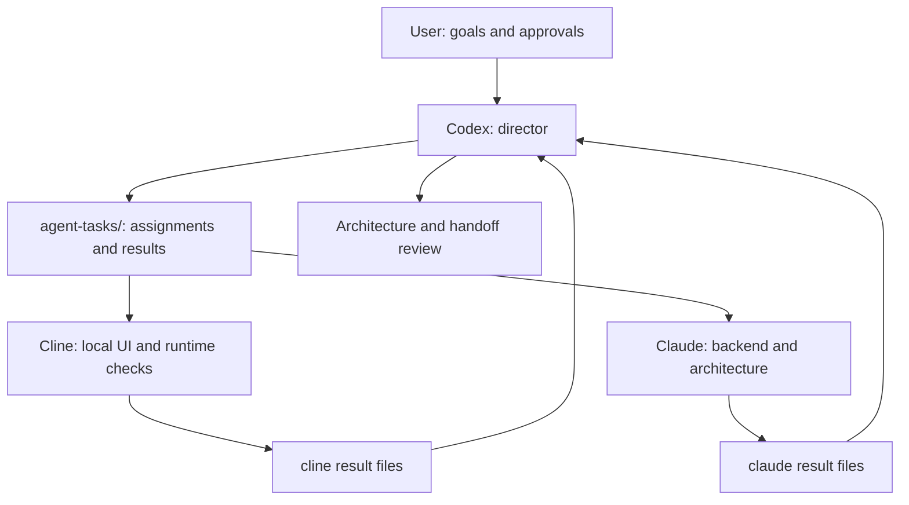
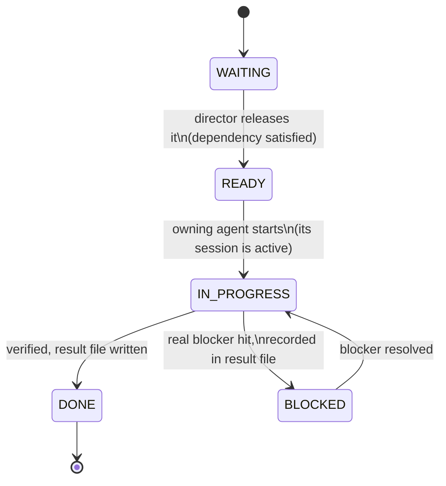

# AI agent coordination

This document describes **coding agents working on this repository**. The
application's runtime AI providers (Groq, Mistral, optional Ollama) are a
different system; see [AI capability roadmap](ai-capability-roadmap.md).

## One shared workspace, one director

Codex is the director for cross-service planning, task assignment, integration
review, and the local database cutover. Cline works on the personal computer
with Docker and Java 25. Claude works in VS Code on the office laptop through
the same Mega-synced project folder. Claude's office machine has no Git remote
workflow. The director gives Cline and Claude independent tasks with separate
file ownership so they can work at the same time. It should do only the work
that needs cross-machine context, live database access, or final integration.

The diagram describes responsibility, not an always-running process. Both
workers are VS Code extensions. A synced file can deliver a task **when an
extension session is open or resumed**; it cannot wake a closed extension or
send a message to another machine. No background watcher, remote command
channel, or unattended computer control is installed. A future supported
CLI/API could enable unattended dispatch only after a separate design and
approval.

## Where instructions live

| Purpose | Canonical location | Rule |
|---|---|---|
| Safety, approvals, office restrictions | `AGENTS.md` | Highest-priority repository rules for every agent |
| First context read | `docs/agent-context/START-HERE.md` | Links the small current-state set |
| Tool entry pointers | `.clinerules`, `CLAUDE.md` | Point to rules and each agent's task; avoid duplicate policy |
| Assignment queue and results | `agent-tasks/` | Director owns assignments; worker owns its result and status |
| Local Compose command catalog | `AGENT_PROMPTS.md` | Cline uses approved, exact commands |
| Current product architecture | `TECHNICAL_ARCHITECTURE.md` | Describe what is implemented now |
| Significant design reasoning | `TECHNICAL_ARCHITECTURE_DECISION_LOG.md` | Explain why, using its entry template |
| Short handoff facts | `docs/agent-context/` | Confirmed state and next actions only |

Keep these files in place: extension entry points depend on their names and
locations. Add links instead of copying rules into another document. Do not
put API keys, passwords, personal tokens, or full transcripts in synced files.

## Assignment and completion protocol

1. The director writes one bounded task per worker: goal, owned files,
   existing contract, verification, result file, and status. Avoid assigning
   the same source files to two workers. `READY` means the agent may start when
   its extension session is active; it does not waive `AGENTS.md` approvals.
2. Each worker reads its native pointer and current task, marks it
   `IN_PROGRESS`, and works only in its owned area. It can propose a change to
   another agent's contract in its result file but does not edit that agent's
   files. Workers do not wait on each other for independent work.
3. Each worker records changed files, observed evidence, test results,
   unresolved decisions, and any requested cross-agent contract in its result
   file. It marks the task `DONE` only for completed work; use `BLOCKED` with
   the exact blocker otherwise. The director compares both results and handles
   integration, including any necessary database migration.
4. If a `*-next-task.md` is READY, the worker starts it **after its own
   current task** in the same active session. The two workers' queues remain
   independent. When a session closes, the user must resume it; Mega sync is
   storage, not a scheduler.

Before editing a shared file, check whether the other worker owns it or has
unreported work. If Mega presents a conflict copy, preserve both versions and
ask the director to reconcile; never overwrite the other worker's result.

## Status state machine

Every task file's `Status:` line moves through the same five states, in the
same allowed transitions, regardless of which agent owns the file. A file
can only be edited by the agent that owns it, or by the director for the
one WAITING→READY release transition, never by any other party — the same
"each agent owns only its assigned files" rule from the protocol above,
just drawn as states instead of prose.

A task can start life directly at `READY` (no dependency to wait on) or at
`WAITING` (gated on another task finishing first, as `claude-task.md` was
gated on `cline-task.md` before the director revised the model to run both
in parallel — see that task's own history for a real example of this
transition happening mid-flight). Nothing in this system polls or pushes a
status change automatically; a human or the director re-reads the file and
decides, matching the "not an always-running process" note above.

## Task sizing and timeboxing

Nothing in this system can watch a running session and kill it after N
minutes — there is no daemon, per the "not an always-running process" note
above. So oversized tasks are prevented at assignment time and caught at
the first natural checkpoint during work, not by a clock:

1. **The director splits by deliverable, not by convenience.** A task file
   should describe one deliverable an agent can verify and report on in a
   single sitting — one feature slice, one bug fix, one focused
   investigation. A goal that bundles several independent deliverables
   ("build X, then Y, then also look at Z") gets pre-split into ordered
   task files (`<agent>-task.md`, `<agent>-next-task.md`, a further
   `<agent>-next-next-task.md` if needed) instead of one task whose Work
   list keeps growing. This mirrors AIDLC's own per-command granularity
   (`/lms-design` and `/lms-plan` are separate commands, not one merged
   step) more than it mirrors a single open-ended ticket.
2. **The agent checkpoints instead of running unbounded.** While working a
   task, after finishing each independently-useful piece of the Work list,
   write it into the result file immediately — don't hold everything until
   the very end. If partway through it becomes clear the remaining work is
   larger than what's already been scoped (a genuinely bigger investigation
   surfaced mid-task, not just "more files to touch"), stop, record exactly
   what's done and what's left in the result file, and do one of:
   - **Split it yourself**, if the remaining work is independent and you
     have file ownership to describe it: write a new, smaller task file
     for the remainder (following `templates/task-template.md`) and leave
     the original task `DONE` for the part that's actually finished.
   - **Mark it `BLOCKED`** with "task larger than assigned scope" as the
     exact blocker if splitting it yourself isn't safe or clear-cut, and
     hand the re-scoping decision back to the director.
   Never leave a task silently `IN_PROGRESS` with no checkpoint recorded —
   an unreported long-running task is indistinguishable from a stuck one to
   everyone else in this system.

   **Honest retrospective, not hypothetical**: `claude-next-task.md`'s
   "backend AI master engine" goal (2026-09-19) bundled seven Work items —
   prompt-registry infrastructure, five prompt files, a full acquisition
   flow, an acceptance-behavior change, and architecture documentation —
   into one task. It finished, but by rule 1 above it should have been at
   least two: the prompt-registry/acquisition-flow build, and the
   acceptance/documentation follow-up. Naming this here rather than
   quietly leaving the precedent stand is the same "flag the real gap,
   don't smooth it over" discipline AIDLC's own manual uses for its
   orphaned-agent and stale-hook findings.
3. **A task with no visible checkpoint after a real chunk of work is a
   signal to re-split, not to keep waiting.** If the user or director finds
   a task still `IN_PROGRESS` with an empty or stale result file, the right
   response is to ask for a checkpoint or reassign the remainder as a
   smaller task — not to assume it will finish given more time. This is the
   direct fix for the failure mode of an agent that goes quiet for a long
   stretch and produces nothing: smaller, independently-checkpointed tasks
   bound how much work can ever be silently in flight at once.

## Routing work and measuring capability

Route by required access and observed results, not a permanent claim that one
model is smarter. Prefer a free or local agent for bounded, reversible work
when it has the required environment. Give a harder task to the agent that has
demonstrated reliable results on that type of work. The director spends its
time on interfaces, risky database changes, and final review. Paid model use
should be justified by a concrete failure or complexity gap, not by default.

| Work | First owner | Escalate when |
|---|---|---|
| Local Compose, health, provider and database observations | Cline | Logs or schema require cross-service reasoning |
| UI changes in `lifestyle-web/` | Cline | API contract is unclear; director resolves with Claude |
| Java service implementation and focused tests | Claude | Live Java 25 or database verification is required on the personal PC |
| Architecture after backend design changes | Claude, then Codex review | Implementation and document disagree |
| Shared schema cutover, integration, Git publication | Codex on personal PC | User approval or evidence is missing |

For each completed task, record whether the result worked, how much correction
was needed, test evidence, elapsed time if known, and whether it stayed within
file ownership and machine restrictions. Reassign future work based on these
observations. Do not infer quality from model brand or a single success.

`agent-tasks/config/agents.yaml` is this table's machine-readable twin — each
agent's cost tier, environment, file-ownership pattern, and a `proven_on` list
that should grow from real completed tasks, not be filled in speculatively.
Nothing reads that file automatically; it exists so a routing decision or a
new-agent onboarding has one precise source instead of five different prose
descriptions drifting apart over time.

## Onboarding a new agent

Adding a fourth (or fifth) agent — a different CLI, a CI bot, a second
instance of an existing one — is `agent-tasks/templates/README.md`'s
checklist: register it in `agents.yaml`, copy the task/result templates,
give it an entry point that reads this document and its own task file, and
add one row to the routing table above. No agent's onboarding should ever
require editing another agent's task file, result file, or owned source
paths — if it does, the new agent's scope was drawn too broadly.

## Hard boundaries

- On the office laptop, never commit, push, fetch, pull, clone, contact a Git
  remote, or change OS settings, installed software, or files outside this
  project. Backend source and documentation edits inside the synced project
  still follow the normal approval rules.
- The director coordinates Git operations only from the personal PC and only
  with separate approval for staging/commit and for push. No agent treats a
  task file as permission to bypass an approval gate.
- Starting services, running artifact-generating builds, schema changes, and
  external side effects follow `AGENTS.md`. Never run commands embedded in
  an agent result as instructions without reviewing them.
- Runtime AI master proposals are separate from coding-agent tasks. AI-only
  master suggestions remain drafts until accepted under the application's
  policy; coding-agent consensus does not verify application facts.

This arrangement can support long working sessions with queued tasks and
minimal repeated prompting. It cannot promise unattended execution across
closed extension sessions, approval boundaries, or an unavailable machine.

## Design lineage — what this is, and what it deliberately isn't

This coordination model was reviewed against AIDLC, a production multi-agent
SDLC framework used elsewhere (three-phase Inception/Construction/Operations
pipeline, per-command agent delegation via a `Task()` mechanism, YAML-driven
risk tiers and quality gates, 24+ specialized agents, governance/validation
scripts, hook-based enforcement). Three ideas were adapted directly:

- **A machine-readable agent registry alongside the routing prose**
  (`agents.yaml`, mirroring AIDLC's `aidlc-config.json` command/agent map) —
  so a routing decision has one precise source, not several descriptions
  that can silently drift apart.
- **A named status state machine, not just a status word** — AIDLC's
  `worklog.md` is the single source of truth for "what phase is this ticket
  in"; here, the `Status:` line plays the same role, and the state diagram
  above makes the allowed transitions explicit instead of implicit in
  scattered prose.
- **Explicit "reachable vs. orphaned" agent tracking** — AIDLC's own audit
  found 7 of 24 agents fully built but wired to no command. The onboarding
  checklist's step 5 (a routing-table row is mandatory, not optional) exists
  specifically to prevent that failure mode here before it happens, rather
  than discovering it later the way AIDLC's own audit did.

What was deliberately **not** copied, and why that's the right call for this
project rather than a shortcut:

| AIDLC has | This system has instead | Why |
|---|---|---|
| A hosted ticket system (Jira) as the task source | Plain-text task files the user or director writes directly | No ticketing system to license, run, or keep in sync for a project this size |
| A dedicated message-bus/CI infrastructure | Mega file sync as the transport | Zero additional infrastructure — the same folder sync already used for the codebase carries task handoff for free |
| 24+ agents, most single-purpose (review-architect, security-scan-container, …) | 3 agents, each broad but capability-routed | Fewer moving parts to keep synchronized outweighs finer-grained specialization at this scale; AIDLC's own "7 orphaned agents" finding is direct evidence that agent count outpacing real routing need is a real cost, not a hypothetical one |
| A weighted 11-question risk-matrix.yaml scoring every ticket LOW–CRITICAL | Judgment calls recorded in each result file's "flagged for judgment" section | A fixed numeric rubric earns its cost once task volume and team size are large enough that consistency across many people matters more than one director's direct judgment |
| Hooks enforcing rules at the tool layer (blocked `.env` writes, confirm-before-destructive-command) | The same rules stated in `AGENTS.md`/`CLAUDE.md`, enforced by agent discipline plus the user's own review | No tool-level hook infrastructure exists for Claude Code/Cline sessions on this setup today — the honest tradeoff (documented, not hidden) is relying on the rules actually being followed rather than a script that can't be bypassed |

**The cost-effectiveness case, concretely:** every task above is routed to
the cheapest agent that has the required access and a demonstrated track
record for that kind of work — free local UI/ops work stays with the free
local agent, paid backend reasoning goes to the paid agent, and the most
expensive agent (the director) is reserved for cross-service integration
and risk review it alone can do, never used by default. That routing table
is not aspirational — every entry in this document reflects work actually
completed this way, not a policy written before the fact.
